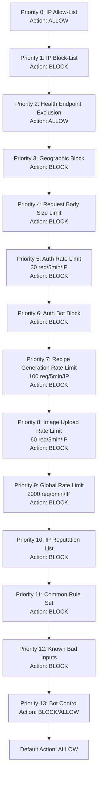

# Design Document: AWS WAF Integration

## Overview

This design introduces an AWS WAF Web ACL associated with the existing Application Load Balancer to provide edge-level traffic filtering for the Recipe AI Finder application. The WAF acts as a first line of defense, evaluating and blocking malicious traffic before it reaches the ECS-hosted Spring Boot backend, complementing the existing application-level security controls (RateLimitFilter, RequestSizeLimitFilter, SecurityConfig).

The WAF configuration is implemented as a new Terraform module (`infrastructure/modules/waf`) integrated into the existing IaC structure. It leverages AWS Managed Rule Groups for common exploit protection, custom rules for application-specific rate limiting, IP-based access control, geographic restrictions, and comprehensive logging to S3 with CloudWatch alarms.

### Design Decisions

| Decision | Choice | Rationale |
|----------|--------|-----------|
| IaC Tool | Terraform | Project already uses Terraform with modular structure, S3 backend, and env-specific tfvars |
| WAF Scope | REGIONAL | ALB is regional (us-east-1); CloudFront scope not needed |
| Logging Destination | S3 | Cost-effective per Requirement 10; lifecycle policy for 90-day retention |
| Bot Control Level | Common | Targeted level costs significantly more; common covers the required use cases |
| Module Placement | `infrastructure/modules/waf` | Follows existing module pattern (alb, ecs, s3, etc.) |
| State Management | Separate state file | WAF module uses its own Terraform state (S3 backend, separate key) to enable independent deployments, reduce plan latency, and limit blast radius on state corruption. Reads ALB ARN from main state via `terraform_remote_state` data source. |

### Layered Security Model

```
┌─────────────────────────────────────────────────────────────┐
│                      Internet Traffic                         │
└────────────────────────────┬────────────────────────────────┘
                             │
                             ▼
┌─────────────────────────────────────────────────────────────┐
│              AWS WAF Web ACL (Edge Layer)                     │
│  • IP Allow/Block Lists                                      │
│  • Geographic Restrictions                                   │
│  • Rate-Based Rules (per-IP, per-endpoint)                   │
│  • Request Size Enforcement                                  │
│  • Managed Rule Groups (SQLi, XSS, Bot Control)             │
└────────────────────────────┬────────────────────────────────┘
                             │ (Allowed requests only)
                             ▼
┌─────────────────────────────────────────────────────────────┐
│              Application Load Balancer                        │
│  • TLS Termination (TLS 1.3)                                 │
│  • Path-based routing (backend /api/*, frontend /*)          │
└────────────────────────────┬────────────────────────────────┘
                             │
                             ▼
┌─────────────────────────────────────────────────────────────┐
│         Spring Boot Application (App Layer)                   │
│  • RequestSizeLimitFilter (1 MB body limit)                  │
│  • RateLimitFilter (per-user Bucket4j)                       │
│  • SecurityConfig (CORS, CSP, HSTS, JWT validation)          │
│  • OAuth2 Resource Server (Cognito JWT)                      │
└─────────────────────────────────────────────────────────────┘
```

The WAF handles coarse-grained, IP-based, and signature-based blocking at the edge. The application-level filters handle fine-grained, user-identity-based rate limiting and request validation. Both layers are intentionally complementary — WAF prevents volumetric abuse from reaching the application, while the app filters enforce per-authenticated-user quotas.

## Architecture

### Terraform Module Structure

```
infrastructure/
├── main.tf                    # existing infra (no WAF module block here)
├── waf/
│   ├── main.tf               # WAF-specific root: backend config, provider, module call
│   ├── variables.tf          # WAF root variables
│   ├── outputs.tf            # WAF root outputs
│   ├── data.tf               # terraform_remote_state to read ALB ARN from main state
│   ├── environments/
│   │   ├── dev.tfvars
│   │   └── prod.tfvars
│   └── modules/
│       └── waf/
│           ├── main.tf            # Web ACL, rules, associations
│           ├── ip_sets.tf         # Allow-list and block-list IP sets
│           ├── logging.tf         # S3 bucket, WAF logging config
│           ├── monitoring.tf      # CloudWatch alarms, SNS, budgets
│           ├── variables.tf       # Module input variables
│           └── outputs.tf         # Module outputs
```

### Web ACL Rule Priority Order

Rules are evaluated in ascending priority order. Lower numbers are evaluated first.



| Priority | Rule Name | Type | Action | Scope |
|----------|-----------|------|--------|-------|
| 0 | AllowListedIPs | IP Set Match | ALLOW | All requests |
| 1 | BlockListedIPs | IP Set Match | BLOCK | All requests |
| 2 | AllowHealthEndpoint | Byte Match | ALLOW | GET /api/health |
| 3 | GeoBlockRule | Geo Match | BLOCK | Configured countries |
| 4 | RequestBodySizeLimit | Size Constraint | BLOCK | Body > 1MB (10MB for uploads) |
| 5 | AuthRateLimit | Rate-Based | BLOCK | POST /api/auth/* |
| 6 | AuthBotBlock | Label Match | BLOCK | /api/auth/* with bot label |
| 7 | RecipeGenRateLimit | Rate-Based | BLOCK | POST /api/recipes/generate |
| 8 | ImageUploadRateLimit | Rate-Based | BLOCK | POST /api/images/upload |
| 9 | GlobalRateLimit | Rate-Based | BLOCK | All requests |
| 10 | AWSManagedRulesAmazonIpReputationList | Managed | BLOCK | All requests |
| 11 | AWSManagedRulesCommonRuleSet | Managed | BLOCK | All requests |
| 12 | AWSManagedRulesKnownBadInputsRuleSet | Managed | BLOCK | All requests |
| 13 | AWSManagedRulesBotControlRuleSet | Managed | BLOCK/ALLOW | All requests |

Total: 14 rules (within the 10 rule-group/custom-rule cost target from Req 10 — note that rate-based rules and IP set rules each count as 1 WCU rule, and some can be consolidated).

**Cost Optimization Note:** To stay within the 10-rule budget specified in Requirement 10, the auth-related rules (priority 5 and 6) can be combined into a single rule group, and the three endpoint-specific rate limits can be consolidated. Final implementation will target ≤10 billable rule slots.

## Components and Interfaces

### Module: `infrastructure/modules/waf`

#### Inputs (variables.tf)

| Variable | Type | Description | Default |
|----------|------|-------------|---------|
| `project_name` | string | Project name prefix | — |
| `environment` | string | Environment (dev/prod) | — |
| `alb_arn` | string | ARN of the ALB to associate | — |
| `allowed_ips` | list(string) | CIDR ranges for allow-list | `[]` |
| `blocked_ips` | list(string) | CIDR ranges for block-list | `[]` |
| `geo_block_countries` | list(string) | ISO 3166-1 alpha-2 country codes to block | `[]` |
| `rate_limit_global` | number | Global requests per 5-min per IP | `2000` |
| `rate_limit_recipe_gen` | number | Recipe gen requests per 5-min per IP | `100` |
| `rate_limit_image_upload` | number | Image upload requests per 5-min per IP | `60` |
| `rate_limit_auth` | number | Auth endpoint requests per 5-min per IP | `30` |
| `waf_log_bucket_name` | string | S3 bucket name for WAF logs | — |
| `alarm_sns_topic_arn` | string | SNS topic ARN for alarms | — |
| `blocked_requests_alarm_threshold` | number | Blocked count for alarm trigger in 5-min | `1000` |
| `budget_limit_amount` | string | Monthly WAF budget limit USD | `"50"` |
| `budget_notification_email` | string | Email for budget alerts | — |

#### Outputs (outputs.tf)

| Output | Description |
|--------|-------------|
| `web_acl_id` | ID of the created Web ACL |
| `web_acl_arn` | ARN of the created Web ACL |
| `waf_log_bucket_arn` | ARN of the WAF logging S3 bucket |
| `ip_allow_set_id` | ID of the allow-list IP set (for independent updates) |
| `ip_block_set_id` | ID of the block-list IP set (for independent updates) |

#### Integration Point: ALB Module

The main infrastructure must expose the ALB ARN as a root output so the WAF state can read it via `terraform_remote_state`:

```hcl
# infrastructure/modules/alb/outputs.tf (addition)
output "alb_arn" {
  value = aws_lb.main.arn
}
```

```hcl
# infrastructure/outputs.tf (addition — exposes ALB ARN from main state)
output "alb_arn" {
  value = module.alb.alb_arn
}
```

The WAF root reads the ALB ARN from the main state via a data source:

```hcl
# infrastructure/waf/data.tf
data "terraform_remote_state" "main" {
  backend = "s3"
  config = {
    bucket = "recipe-ai-finder-terraform-state"
    key    = "main/terraform.tfstate"
    region = "us-east-1"
  }
}

# Then reference: data.terraform_remote_state.main.outputs.alb_arn
```

The WAF root module call consumes this:

```hcl
# infrastructure/waf/main.tf
module "waf" {
  source       = "./modules/waf"
  project_name = var.project_name
  environment  = var.environment
  alb_arn      = data.terraform_remote_state.main.outputs.alb_arn

  allowed_ips         = var.waf_allowed_ips
  blocked_ips         = var.waf_blocked_ips
  geo_block_countries = var.waf_geo_block_countries

  rate_limit_global       = var.waf_rate_limit_global
  rate_limit_recipe_gen   = var.waf_rate_limit_recipe_gen
  rate_limit_image_upload = var.waf_rate_limit_image_upload
  rate_limit_auth         = var.waf_rate_limit_auth

  waf_log_bucket_name             = "${var.project_name}-${var.environment}-waf-logs"
  alarm_sns_topic_arn             = var.waf_alarm_sns_topic_arn
  blocked_requests_alarm_threshold = var.waf_blocked_requests_alarm_threshold
  budget_limit_amount             = var.waf_budget_limit_amount
  budget_notification_email       = var.waf_budget_notification_email
}
```

### Key Terraform Resources

#### Web ACL (main.tf)

```hcl
resource "aws_wafv2_web_acl" "main" {
  name        = "${var.project_name}-${var.environment}-web-acl"
  scope       = "REGIONAL"
  description = "WAF Web ACL for ${var.project_name} ${var.environment}"

  default_action {
    allow {}
  }

  # Rules defined with priority ordering as specified above
  # ...

  visibility_config {
    cloudwatch_metrics_enabled = true
    metric_name                = "${var.project_name}-${var.environment}-waf"
    sampled_requests_enabled   = true
  }
}

resource "aws_wafv2_web_acl_association" "alb" {
  resource_arn = var.alb_arn
  web_acl_arn  = aws_wafv2_web_acl.main.arn
}
```

#### IP Sets (ip_sets.tf)

```hcl
resource "aws_wafv2_ip_set" "allow_list" {
  name               = "${var.project_name}-${var.environment}-allow-list"
  scope              = "REGIONAL"
  ip_address_version = "IPV4"
  addresses          = var.allowed_ips

  tags = {
    Name        = "${var.project_name}-${var.environment}-allow-list"
    Environment = var.environment
  }
}

resource "aws_wafv2_ip_set" "block_list" {
  name               = "${var.project_name}-${var.environment}-block-list"
  scope              = "REGIONAL"
  ip_address_version = "IPV4"
  addresses          = var.blocked_ips

  tags = {
    Name        = "${var.project_name}-${var.environment}-block-list"
    Environment = var.environment
  }
}
```

#### S3 Logging (logging.tf)

```hcl
resource "aws_s3_bucket" "waf_logs" {
  bucket = var.waf_log_bucket_name

  tags = {
    Name        = var.waf_log_bucket_name
    Environment = var.environment
  }
}

resource "aws_s3_bucket_lifecycle_configuration" "waf_logs" {
  bucket = aws_s3_bucket.waf_logs.id

  rule {
    id     = "expire-logs-90-days"
    status = "Enabled"

    expiration {
      days = 90
    }
  }
}

resource "aws_wafv2_web_acl_logging_configuration" "main" {
  log_destination_configs = [aws_s3_bucket.waf_logs.arn]
  resource_arn            = aws_wafv2_web_acl.main.arn

  logging_filter {
    default_behavior = "DROP"

    filter {
      behavior    = "KEEP"
      requirement = "MEETS_ANY"

      condition {
        action_condition {
          action = "BLOCK"
        }
      }
    }

    filter {
      behavior    = "KEEP"
      requirement = "MEETS_ANY"

      condition {
        action_condition {
          action = "ALLOW"
        }
      }
      # 1% sampling achieved via CloudWatch metric filter
      # WAF native logging logs all blocked + sampled allowed
    }
  }
}
```

#### CloudWatch Monitoring (monitoring.tf)

```hcl
resource "aws_cloudwatch_metric_alarm" "waf_blocked_requests" {
  alarm_name          = "${var.project_name}-${var.environment}-waf-blocked-high"
  comparison_operator = "GreaterThanThreshold"
  evaluation_periods  = 1
  metric_name         = "BlockedRequests"
  namespace           = "AWS/WAFV2"
  period              = 300
  statistic           = "Sum"
  threshold           = var.blocked_requests_alarm_threshold
  alarm_description   = "WAF blocked requests exceeded ${var.blocked_requests_alarm_threshold} in 5 minutes"

  dimensions = {
    WebACL = aws_wafv2_web_acl.main.name
    Region = data.aws_region.current.name
    Rule   = "ALL"
  }

  alarm_actions = [var.alarm_sns_topic_arn]
}

resource "aws_budgets_budget" "waf_cost" {
  name         = "${var.project_name}-${var.environment}-waf-budget"
  budget_type  = "COST"
  limit_amount = var.budget_limit_amount
  limit_unit   = "USD"
  time_unit    = "MONTHLY"

  cost_filter {
    name   = "Service"
    values = ["AWS WAF"]
  }

  notification {
    comparison_operator       = "GREATER_THAN"
    threshold                 = 100
    threshold_type            = "PERCENTAGE"
    notification_type         = "ACTUAL"
    subscriber_email_addresses = [var.budget_notification_email]
  }
}
```

## Data Models

### WAF Log Record Structure (S3)

WAF logs are stored in JSON Lines format in S3 under the `waf-logs/` prefix. Each record follows the standard AWS WAF log format:

```json
{
  "timestamp": 1234567890000,
  "formatVersion": 1,
  "webaclId": "arn:aws:wafv2:us-east-1:...:regional/webacl/...",
  "terminatingRuleId": "AuthRateLimit",
  "terminatingRuleType": "RATE_BASED",
  "action": "BLOCK",
  "httpSourceName": "ALB",
  "httpSourceId": "...",
  "ruleGroupList": [],
  "rateBasedRuleList": [
    {
      "rateBasedRuleId": "...",
      "limitKey": "IP",
      "maxRateAllowed": 30
    }
  ],
  "nonTerminatingMatchingRules": [],
  "httpRequest": {
    "clientIp": "203.0.113.42",
    "country": "US",
    "headers": [...],
    "uri": "/api/auth/login",
    "args": "",
    "httpVersion": "HTTP/2.0",
    "httpMethod": "POST",
    "requestId": "..."
  },
  "labels": [
    { "name": "awswaf:managed:aws:bot-control:bot:unverified" },
    { "name": "custom:AUTH_RATE_LIMIT" }
  ]
}
```

### Environment Parameters

| Parameter | Dev (50% of prod) | Prod |
|-----------|-------------------|------|
| `waf_rate_limit_global` | 1000 | 2000 |
| `waf_rate_limit_recipe_gen` | 50 | 100 |
| `waf_rate_limit_image_upload` | 30 | 60 |
| `waf_rate_limit_auth` | 15 | 30 |
| `waf_blocked_requests_alarm_threshold` | 500 | 1000 |
| `waf_budget_limit_amount` | "25" | "50" |
| `waf_geo_block_countries` | `[]` | `[]` (configurable) |
| `waf_allowed_ips` | `[]` | `[]` |
| `waf_blocked_ips` | `[]` | `[]` |

### Request Size Rule Behavior

| Endpoint | WAF Size Limit | App-Level Limit | Note |
|----------|---------------|-----------------|------|
| POST /api/images/upload | 10 MB | Spring multipart config | Image uploads get larger allowance |
| All other endpoints | 1 MB | RequestSizeLimitFilter (1 MB) | WAF rejects at edge; app filter is defense-in-depth |
| GET /api/health | No limit check | N/A | Excluded from size rule |

## Correctness Properties

*Since this feature is Infrastructure as Code (Terraform), traditional property-based testing with randomized inputs does not apply. Instead, correctness properties are defined as declarative assertions verifiable via Terraform plan inspection, `terraform validate`, or post-deploy AWS API calls. Each property states an invariant the deployed WAF configuration must satisfy.*

### Property 1: IP Allow-List Has Highest Priority

The IP allow-list rule SHALL always have the lowest numeric priority value (priority 0) in the Web ACL, ensuring it is evaluated before all other rules.

**Validates: Requirements 6.3**

**Verification:** `terraform plan` output inspection — confirm `priority = 0` on the allow-list rule statement.

### Property 2: Rule Priority Ordering Is Strictly Sequential

For every pair of rules (A, B) where A is specified to evaluate before B in the architecture, A's numeric priority SHALL be strictly less than B's numeric priority in the deployed Web ACL.

**Validates: Requirements 6.3, 6.4, 9.3, 4.5, 8.4**

**Verification:** `aws wafv2 get-web-acl` — extract rule priorities and assert strict ordering matches the design's priority table.

### Property 3: Rate Limit Thresholds Match Environment Parameters

For each rate-based rule, the configured `limit` value SHALL equal the corresponding variable value from the active `.tfvars` file. In dev, each threshold SHALL be exactly 50% of the prod threshold.

**Validates: Requirements 11.4, 4.1, 4.2, 4.3, 8.1**

**Verification:** `terraform plan -var-file=environments/dev.tfvars` — assert each rate-based rule's `limit` matches the expected dev values (1000, 50, 30, 15). Repeat for prod (2000, 100, 60, 30).

### Property 4: All Required Managed Rule Groups Are Present and Unversioned

The Web ACL SHALL contain exactly four managed rule group statements (AWSManagedRulesAmazonIpReputationList, AWSManagedRulesCommonRuleSet, AWSManagedRulesKnownBadInputsRuleSet, AWSManagedRulesBotControlRuleSet), and none SHALL specify a `version` attribute, ensuring automatic updates.

**Validates: Requirements 2.1, 2.2, 2.3, 2.4, 2.5**

**Verification:** `aws wafv2 get-web-acl` — enumerate managed rule group statements, assert count = 4, assert no `Version` field in any statement.

### Property 5: IP Sets Are Independently Updatable

The `aws_wafv2_ip_set` resources (allow-list and block-list) SHALL be defined as standalone Terraform resources with no lifecycle dependency on the Web ACL resource itself. A change to IP set addresses SHALL not force replacement of the Web ACL.

**Validates: Requirements 6.5**

**Verification:** `terraform plan` after modifying only the `allowed_ips` or `blocked_ips` variable — assert the plan shows only an in-place update to the IP set resource and no change to `aws_wafv2_web_acl`.

### Property 6: WAF Logging Targets the Correct S3 Bucket

The WAF logging configuration SHALL reference the S3 bucket whose name matches `${project_name}-${environment}-waf-logs`, and the bucket SHALL have a lifecycle rule expiring objects at 90 days.

**Validates: Requirements 7.1, 7.6, 10.3**

**Verification:** `aws wafv2 get-logging-configuration` — assert `LogDestinationConfigs` contains the expected bucket ARN. `aws s3api get-bucket-lifecycle-configuration` — assert expiration days = 90.

### Property 7: ALB Association Exists After Deployment

After a successful `terraform apply`, the Web ACL SHALL be associated with the target ALB. The association SHALL be verifiable via the WAF API.

**Validates: Requirements 1.1, 12.4**

**Verification:** `aws wafv2 get-web-acl-for-resource --resource-arn <ALB_ARN>` — assert the returned Web ACL ARN matches the deployed Web ACL.

### Property 8: Default Action Is ALLOW

The Web ACL's default action SHALL be `ALLOW`, ensuring that requests not matching any rule are permitted through to the ALB.

**Validates: Requirements 1.2**

**Verification:** `aws wafv2 get-web-acl` — assert `DefaultAction` is `{"Allow": {}}`.

### Property 9: Health Endpoint Exclusion Precedes Rate and Managed Rules

The health endpoint allow rule (matching GET /api/health) SHALL have a priority value lower than all rate-based rules and all managed rule group rules, but higher than the IP block-list rule.

**Validates: Requirements 9.1, 9.3**

**Verification:** `terraform plan` output — confirm the health rule's priority sits between the IP block-list priority and the first rate-based rule priority.

### Property 10: Cost Constraint — Rule Count Within Budget

The total number of rule statements (custom rules + managed rule group references) in the Web ACL SHALL not exceed 10 billable rule slots.

**Validates: Requirements 10.1**

**Verification:** `aws wafv2 get-web-acl` — count top-level `Rules` array entries, assert ≤ 10. Cross-reference with `terraform plan` resource count.

## Error Handling

### WAF Block Responses

When WAF blocks a request, it returns an HTTP 403 with a default AWS WAF response body. The response differs from the application's 429 rate-limit response:

| Layer | HTTP Status | Response Body | Use Case |
|-------|-------------|---------------|----------|
| WAF (rate/geo/IP/rule block) | 403 | AWS WAF default block page | Edge-level rejection |
| App RateLimitFilter | 429 | `{"status":429,"message":"Rate limit exceeded..."}` | Per-user rate limiting |
| App RequestSizeLimitFilter | 413 | `{"status":413,"message":"Payload Too Large..."}` | Body size validation |

### Custom Response Bodies

The WAF module configures custom response bodies for rate-limit blocks to provide actionable client feedback:

```hcl
custom_response_body {
  key          = "rate-limited"
  content      = "{\"status\":403,\"message\":\"Request blocked by WAF rate limit. Try again later.\"}"
  content_type = "APPLICATION_JSON"
}
```

### Failure Scenarios

| Scenario | Behavior | Mitigation |
|----------|----------|------------|
| WAF deployment fails | CI/CD pipeline halts; no app deployment | Terraform plan validation before apply |
| Managed rule false positive | Legitimate API request blocked | Rule exclusion list in CommonRuleSet (Req 2.7); monitoring alerts |
| IP set update fails | Previous IP set remains active | IP sets are independent resources; atomic updates |
| Logging S3 bucket unreachable | WAF continues operating; logs are dropped | CloudWatch alarm on logging errors |
| ALB already has Web ACL | Association replacement via Terraform | Terraform manages lifecycle; old association removed automatically |

### False Positive Handling

The AWSManagedRulesCommonRuleSet may generate false positives for the application's API patterns. Known candidates for exclusion:

- `SizeRestrictions_BODY` — may conflict with the larger upload endpoint; handled by the scope-down statement on the size rule
- `CrossSiteScripting_BODY` — recipe descriptions may contain characters that trigger XSS signatures
- `GenericRFI_BODY` — URLs in recipe content may trigger remote file inclusion rules

These exclusions are configured via `excluded_rule` blocks within the managed rule group statement and should be validated during initial deployment to dev.

## Testing Strategy

### Why Property-Based Testing Does Not Apply

This feature is primarily Infrastructure as Code (Terraform). The deliverables are declarative resource definitions, not functions with input/output behavior. PBT is not appropriate because:

- WAF rules are declarative configuration, not pure functions
- There is no input space to generate — the "inputs" are Terraform variables with fixed schemas
- Correctness is verified by plan validation and integration tests against real AWS APIs
- The feature's logic lives in AWS WAF's rule evaluation engine, not in application code

### Testing Approach

#### 1. Terraform Validation (Pre-deploy)

- `terraform validate` — syntax and provider schema validation
- `terraform plan` — changeset review before apply
- `terraform plan -detailed-exitcode` — CI assertion that plan exits cleanly
- `tflint` — Terraform linting for best practices and AWS-specific rules

#### 2. Integration Tests (Post-deploy to dev)

| Test Case | Method | Assertion |
|-----------|--------|-----------|
| Web ACL exists and is associated with ALB | AWS CLI: `aws wafv2 get-web-acl` + `list-resources-for-web-acl` | Returns valid ACL; ALB ARN in association list |
| Blocked IP is rejected | `curl` from blocked IP / add test IP to block list | HTTP 403 response |
| Allowed IP bypasses rules | Add test IP to allow list | HTTP 200 despite other rule matches |
| Rate limit triggers on auth endpoint | Rapid-fire 31+ POST requests to /api/auth/login | 403 after threshold |
| Health endpoint is not rate-limited | 100 rapid GET requests to /api/health | All return 200 |
| Oversized body is rejected | POST with >1MB body to /api/recipes/generate | HTTP 403 |
| Upload endpoint allows up to 10MB | POST with 5MB body to /api/images/upload | Not blocked by WAF |
| Geo-blocked country is rejected | Add test country; request from that geo | HTTP 403 |
| WAF logs appear in S3 | Trigger a block; wait; check S3 | Log record present in bucket |
| CloudWatch metrics emit | Trigger blocks; check CloudWatch | BlockedRequests metric > 0 |

#### 3. CI/CD Pipeline Validation

- Terraform plan runs on every PR touching `infrastructure/` files
- Plan output is posted as a PR comment for review
- Apply only executes on merge to main (or via workflow dispatch)
- Post-apply verification step confirms Web ACL association

#### 4. Smoke Tests (Deploy Verification)

After WAF deployment, the CI pipeline runs:
1. `aws wafv2 get-web-acl` — verify resource exists
2. `aws wafv2 list-resources-for-web-acl` — verify ALB association
3. `curl -s -o /dev/null -w "%{http_code}" https://recipe-ai-finder.com/api/health` — verify health endpoint still accessible through WAF

### GitHub Actions CI/CD Integration

The existing `deploy.yml` workflow is extended with a WAF deployment step:

```yaml
# Addition to .github/workflows/deploy.yml
- name: Terraform Init (WAF)
  working-directory: ./infrastructure/waf
  run: terraform init

- name: Terraform Plan (WAF)
  working-directory: ./infrastructure/waf
  run: |
    terraform plan \
      -var-file=environments/${{ github.event.inputs.environment || 'dev' }}.tfvars \
      -out=tfplan
  timeout-minutes: 10

- name: Terraform Apply (WAF)
  working-directory: ./infrastructure/waf
  run: terraform apply -auto-approve tfplan
  timeout-minutes: 10

- name: Verify WAF Association
  run: |
    ALB_ARN=$(aws elbv2 describe-load-balancers \
      --names "recipe-ai-${{ github.event.inputs.environment || 'dev' }}-alb" \
      --query 'LoadBalancers[0].LoadBalancerArn' --output text)
    WEB_ACL=$(aws wafv2 get-web-acl-for-resource --resource-arn "$ALB_ARN" --query 'WebACL.Name' --output text)
    if [ -z "$WEB_ACL" ]; then
      echo "ERROR: No WAF Web ACL associated with ALB"
      exit 1
    fi
    echo "WAF Web ACL '$WEB_ACL' associated with ALB"
```

These steps are inserted **before** the "Deploy to ECS" step. If any WAF step fails, the workflow halts before application deployment (satisfying Requirement 12.2).

The workflow also supports deploying WAF independently via workflow dispatch by adding `paths` filtering or a separate workflow for infrastructure-only changes.

### WAF + App-Level Security Coordination

| Concern | WAF Layer | App Layer | Notes |
|---------|-----------|-----------|-------|
| Rate limiting | Per-IP, 2000 req/5min global | Per-user (JWT sub), 60 req/min | WAF catches volumetric attacks; app does per-user fairness |
| Body size | 1 MB edge reject (10 MB uploads) | RequestSizeLimitFilter 1 MB | Redundant by design — defense in depth |
| Bot detection | ManagedRulesBotControl | None | WAF-only concern |
| SQL injection | ManagedRulesCommonRuleSet | Parameterized queries (DynamoDB SDK) | Belt and suspenders |
| XSS | ManagedRulesCommonRuleSet | CSP headers (SecurityConfig) | Edge + response headers |
| IP blocking | WAF IP Set block-list | None | WAF-only; app trusts traffic that arrives |
| Auth protection | 30 req/5min + bot label block | Cognito handles auth; no app rate limit on auth | WAF protects the Cognito-fronted auth flow |
