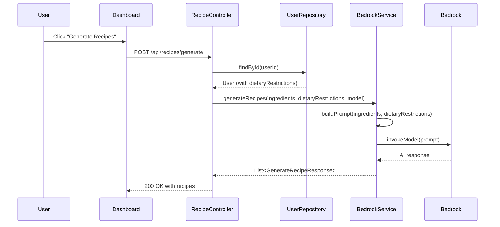

# Design Document: Dietary Restrictions

## Overview

This feature adds dietary restriction management to the Recipe AI Finder application. Users select from a predefined set of 10 dietary restrictions on a dedicated account sub-page. These restrictions are persisted on the User model in DynamoDB and automatically injected into the AI prompt during recipe generation, ensuring generated recipes comply with the user's dietary needs.

The implementation spans three layers:
1. **Backend**: New enum, updated User model, new API endpoints on AccountController, modified BedrockService prompt construction.
2. **Frontend**: Account page restructured into a sidebar layout with a new Dietary Restrictions page and a Dashboard restrictions banner.
3. **AI Integration**: BedrockService.buildPrompt() conditionally appends dietary constraint instructions to the prompt.

## Architecture

```mermaid
flowchart TD
    subgraph Frontend
        A[Account Layout + Sidebar Nav]
        B[Dietary Restrictions Page]
        C[Dashboard Page]
        D[Restriction Badges]
    end

    subgraph Backend
        E[AccountController]
        F[RecipeController]
        G[BedrockService]
        H[UserRepository]
    end

    subgraph Storage
        I[(DynamoDB - Users Table)]
    end

    subgraph External
        J[Amazon Bedrock]
    end

    B -->|GET/PUT /api/account/dietary-restrictions| E
    C -->|GET /api/account/profile| E
    C -->|POST /api/recipes/generate| F
    E -->|findById / save| H
    F -->|findById| H
    F -->|generateRecipes(ingredients, restrictions, model)| G
    H -->|read/write| I
    G -->|invokeModel| J
    D -.->|displays badges from profile| C
```

### Data Flow: Recipe Generation with Dietary Restrictions



## Components and Interfaces

### Backend Components

#### 1. DietaryRestriction Enum

New enum at `io.asbun.backend.model.enums.DietaryRestriction` defining the 10 predefined restriction values.

```java
public enum DietaryRestriction {
    GLUTEN_FREE("Gluten-Free"),
    KETO("Keto"),
    VEGAN("Vegan"),
    VEGETARIAN("Vegetarian"),
    DAIRY_FREE("Dairy-Free"),
    NUT_FREE("Nut-Free"),
    PALEO("Paleo"),
    LOW_CARB("Low-Carb"),
    HALAL("Halal"),
    KOSHER("Kosher");

    private final String displayName;

    DietaryRestriction(String displayName) {
        this.displayName = displayName;
    }

    public String getDisplayName() {
        return displayName;
    }
}
```

#### 2. UpdateDietaryRestrictionsRequest DTO

```java
@Data
public class UpdateDietaryRestrictionsRequest {
    @NotNull
    @Size(max = 10)
    private List<String> restrictions;
}
```

Validation of individual values against `DietaryRestriction` enum is performed in the controller/service layer rather than via annotation, to produce a clear error message listing the invalid values.

#### 3. AccountController Endpoints

| Method | Path | Request Body | Response | Description |
|--------|------|-------------|----------|-------------|
| GET | `/api/account/dietary-restrictions` | - | `200: List<String>` | Returns current restrictions |
| PUT | `/api/account/dietary-restrictions` | `UpdateDietaryRestrictionsRequest` | `200: List<String>` | Updates restrictions |

Controller logic for PUT:
1. Parse request body.
2. Validate each value against `DietaryRestriction.valueOf()`. Collect invalid values.
3. If any invalid → return 400 with invalid values and error message.
4. Deduplicate the list (using `stream().distinct()`).
5. Load user via `userRepository.findById(userId)`. If not found → return 404.
6. Set `dietaryRestrictions` on User, save via `userRepository.save(user)`.
7. Return 200 with the saved list.

#### 4. BedrockService Modification

The `generateRecipes` method signature changes from:
```java
public List<GenerateRecipeResponse> generateRecipes(List<String> ingredients, BedrockModel model)
```
to:
```java
public List<GenerateRecipeResponse> generateRecipes(List<String> ingredients, List<String> dietaryRestrictions, BedrockModel model)
```

The `buildPrompt` method gains a dietary restrictions parameter:
```java
private String buildPrompt(List<String> ingredients, List<String> dietaryRestrictions)
```

When `dietaryRestrictions` is non-null and non-empty, the prompt appends:
```
IMPORTANT DIETARY CONSTRAINTS: The user has the following dietary restrictions: [Gluten-Free, Vegan, ...]. 
You MUST NOT include any ingredients or preparation methods that violate these restrictions. 
Every recipe must fully comply with all listed dietary restrictions.
```

When empty or null, no dietary text is added.

#### 5. RecipeController Modification

Before calling `bedrockService.generateRecipes()`, the controller:
1. Retrieves the user via `userRepository.findById(userId)`.
2. Extracts `dietaryRestrictions` from the User (already loaded for the account status check).
3. If user not found, proceeds with an empty list.
4. Passes the restrictions list to `bedrockService.generateRecipes()`.

#### 6. UserDto Update

Add `dietaryRestrictions` field to UserDto so `GET /api/account/profile` includes it:
```java
private List<String> dietaryRestrictions;
```

### Frontend Components

#### 1. Account Layout (`frontend/app/(protected)/account/layout.tsx`)

A new layout component that wraps all `/account/*` routes. Renders a sidebar navigation with links to:
- `/account/settings` — existing account settings content
- `/account/dietary` — dietary restrictions management

The sidebar uses a `<nav>` element with `aria-label="Account navigation"`. Active link is visually distinguished with a different background color and font weight.

#### 2. Account Settings Page (`frontend/app/(protected)/account/settings/page.tsx`)

The existing `account/page.tsx` content moves here. The current account page becomes a redirect to `/account/settings`.

#### 3. Account Root Redirect (`frontend/app/(protected)/account/page.tsx`)

Simplified to redirect to `/account/settings` using Next.js `redirect()`.

#### 4. Dietary Restrictions Page (`frontend/app/(protected)/account/dietary/page.tsx`)

Client component that:
- Fetches current restrictions on mount via `GET /api/account/dietary-restrictions`.
- Displays 10 predefined restrictions as toggle chips in a flex-wrap layout.
- Tracks selected restrictions in local state.
- "Save" button sends `PUT /api/account/dietary-restrictions`.
- Shows loading spinner during fetch/save, disables Save button.
- Shows success toast for 3+ seconds on save.
- Shows error message with retry option on fetch failure.
- Retains unsaved selections on save failure.

#### 5. Restriction Badges on Dashboard

The Dashboard page is modified to:
- Fetch user profile via `GET /api/account/profile` on mount.
- If `dietaryRestrictions` is non-empty, render a banner above the ingredient form with badge chips and an "Edit" link to `/account/dietary`.
- If empty, render nothing.
- On navigation back, re-fetch profile to reflect updates.

## Data Models

### DynamoDB User Table Changes

| Attribute | Type | Description |
|-----------|------|-------------|
| `dietaryRestrictions` | List of Strings (L → SS) | Stores enum names: `["GLUTEN_FREE", "VEGAN"]`. Defaults to empty list. Max 10 items. |

The DynamoDB enhanced client handles `List<String>` natively via the `@DynamoDbBean` annotation.

### Updated User Model

```java
@Data
@Builder
@NoArgsConstructor
@AllArgsConstructor
@DynamoDbBean
public class User {
    private String userId;
    private String email;
    private String username;
    private Instant createdAt;
    private Integer generateCallsUsed;
    @Builder.Default
    private AccountStatus accountStatus = AccountStatus.ACTIVE;
    private Instant deletionRequestedAt;
    private Instant scheduledDeletionDate;
    @Builder.Default
    private List<String> dietaryRestrictions = new ArrayList<>();

    @DynamoDbPartitionKey
    public String getUserId() {
        return userId;
    }
}
```

### Updated UserDto

```java
@Data
@Builder
@NoArgsConstructor
@AllArgsConstructor
public class UserDto {
    private String userId;
    private String email;
    private String username;
    private Instant createdAt;
    private String accountStatus;
    private Instant scheduledDeletionDate;
    private List<String> dietaryRestrictions;
}
```

### Frontend Types

```typescript
type DietaryRestriction =
  | "GLUTEN_FREE"
  | "KETO"
  | "VEGAN"
  | "VEGETARIAN"
  | "DAIRY_FREE"
  | "NUT_FREE"
  | "PALEO"
  | "LOW_CARB"
  | "HALAL"
  | "KOSHER";

interface DietaryRestrictionOption {
  value: DietaryRestriction;
  label: string;
}
```

## Correctness Properties

*A property is a characteristic or behavior that should hold true across all valid executions of a system — essentially, a formal statement about what the system should do. Properties serve as the bridge between human-readable specifications and machine-verifiable correctness guarantees.*

### Property 1: Restriction persistence round-trip

*For any* valid subset of predefined dietary restrictions (including the empty set), saving them via PUT and then retrieving them via GET SHALL return the same set of restrictions (order-independent).

**Validates: Requirements 1.1, 2.1, 2.2, 2.5**

### Property 2: Invalid restrictions are rejected without side effects

*For any* list containing at least one string that is not a valid DietaryRestriction enum value, the PUT endpoint SHALL return HTTP 400 and the user's stored restrictions SHALL remain unchanged.

**Validates: Requirements 1.3, 2.3**

### Property 3: Deduplication preserves unique values

*For any* list of valid dietary restriction values containing duplicates, the PUT endpoint SHALL save a deduplicated list where each restriction appears exactly once, and the resulting set equals the set of distinct values from the input.

**Validates: Requirements 2.4**

### Property 4: Maximum cardinality enforcement

*For any* list of dietary restrictions submitted via PUT, the stored list SHALL contain at most 10 elements.

**Validates: Requirements 1.4**

### Property 5: Prompt includes all restrictions when present

*For any* non-empty list of valid dietary restrictions and any non-empty list of ingredients, the generated prompt string SHALL contain the display name of every restriction in the list.

**Validates: Requirements 6.1**

### Property 6: Prompt excludes dietary text when restrictions are absent

*For any* empty (or null) dietary restrictions list and any non-empty list of ingredients, the generated prompt string SHALL NOT contain any dietary constraint clause text.

**Validates: Requirements 6.2**

## Error Handling

| Scenario | HTTP Status | Response Body | Component |
|----------|-------------|---------------|-----------|
| Invalid restriction value in PUT body | 400 | `{ "status": 400, "message": "Invalid dietary restriction(s): [X, Y]", "timestamp": "..." }` | AccountController |
| User not found (GET/PUT dietary-restrictions) | 404 | `{ "status": 404, "message": "User not found: {userId}", "timestamp": "..." }` | AccountController via GlobalExceptionHandler |
| User not found during recipe generation | N/A (proceeds with empty list) | - | RecipeController |
| Request body validation failure (null list, size > 10) | 400 | Standard validation error response from GlobalExceptionHandler | AccountController |
| DynamoDB connection failure | 500 | `{ "status": 500, "message": "An unexpected error occurred", "timestamp": "..." }` | GlobalExceptionHandler |
| Frontend fetch failure (GET dietary restrictions) | - | Error message with "Retry" button displayed on page | DietaryRestrictionsPage |
| Frontend save failure (PUT dietary restrictions) | - | Error message displayed; unsaved selections retained | DietaryRestrictionsPage |

Error responses follow the existing `GlobalExceptionHandler` pattern using `Map<String, Object>` with `status`, `message`, and `timestamp` fields.

For the invalid restriction scenario, the AccountController throws an `IllegalArgumentException` with the invalid values listed, which the GlobalExceptionHandler catches and returns as 400.

## Testing Strategy

### Property-Based Testing (Backend - Java with jqwik)

The feature involves data transformations, validation logic, and prompt construction that are well-suited for property-based testing:

- **Library**: [jqwik](https://jqwik.net/) — the standard PBT library for Java/JUnit 5
- **Minimum iterations**: 100 per property test
- **Tag format**: `// Feature: dietary-restrictions, Property {N}: {property text}`

Property tests cover:
1. Round-trip persistence of restriction sets
2. Rejection of invalid restriction values
3. Deduplication behavior
4. Cardinality enforcement
5. Prompt construction with/without restrictions

### Unit Tests (Backend)

- AccountController endpoint tests (MockMvc) for each HTTP scenario
- BedrockService.buildPrompt() tests with specific restriction combinations
- Validation tests for edge cases (empty body, null fields)

### Unit Tests (Frontend)

- DietaryRestrictionsPage: renders all 10 chips, toggles selections, shows loading/error states
- Account layout: renders sidebar with correct active states
- Dashboard badges: renders badges when restrictions exist, hides when empty

### Integration Tests

- End-to-end flow: save restrictions → generate recipe → verify prompt contains restrictions
- DynamoDB integration: verify list attribute serialization/deserialization
