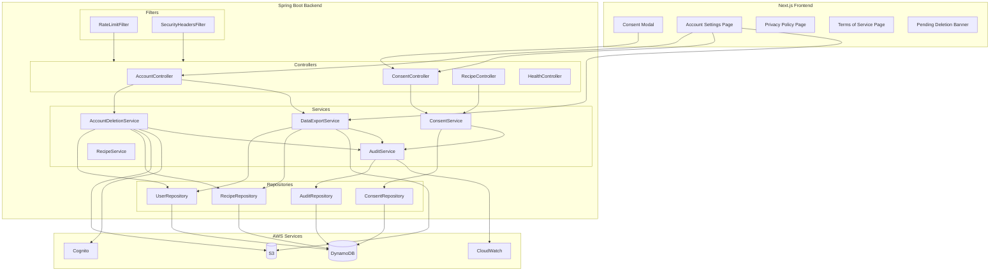
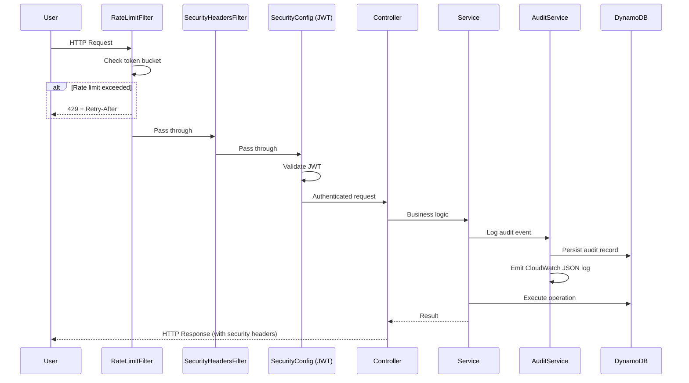

# Design Document: Security & Legal Compliance

## Overview

This design implements a comprehensive GDPR/CCPA/LGPD compliance package for the Recipe AI Finder application. The system introduces account deletion (soft + hard), data export (JSON + ZIP), consent management, audit logging, per-user rate limiting, and security hardening across the Spring Boot backend and Next.js frontend.

The design follows a layered service architecture consistent with the existing codebase patterns — DynamoDB Enhanced Client for persistence, Spring Security filter chain for authorization, and AWS SDK v2 for cloud service interaction.

### Design Decisions

| Decision | Rationale |
|---|---|
| In-memory token bucket for rate limiting | Single-instance Fargate deployment; avoids external Redis dependency. Bucket4j provides a well-tested implementation. |
| DynamoDB + CloudWatch dual-write for audit | DynamoDB enables user-facing audit trail queries; CloudWatch provides ops/legal searchability and integrates with existing logging. |
| Soft delete with `accountStatus` field on User model | Avoids separate table; leverages existing User DynamoDB Enhanced Client pattern. |
| Async ZIP via `@Async` + S3 temp upload | Matches existing `AsyncImageService` pattern; avoids long HTTP connections. |
| Consent stored per-type with composite key | Enables granular grant/revoke without touching other consent records. |
| Spring `@Scheduled` for deletion job | Simple, no external scheduler needed for single-instance deployment. |
| Security headers via Spring Security filter chain | Centralizes header management; consistent with existing SecurityConfig pattern. |

## Architecture



### Request Flow for Compliance Endpoints



## Components and Interfaces

### Backend Services

#### AccountDeletionService

```java
@Service
public class AccountDeletionService {
    // Soft deletion - marks account, sets 30-day timer
    public void requestSoftDeletion(String userId);
    
    // Cancel within grace period
    public void cancelDeletion(String userId);
    
    // Full purge across all stores
    public void executeHardDeletion(String userId);
    
    // Scheduled job - daily processing of overdue accounts
    @Scheduled(cron = "${compliance.deletion.cron:0 0 2 * * *}")
    public void processPendingDeletions();
}
```

#### DataExportService

```java
@Service
public class DataExportService {
    // Synchronous JSON export
    public DataExportJson exportJson(String userId);
    
    // Async ZIP generation, returns export ID
    public String startZipExport(String userId);
    
    // Check export status
    public ExportStatus getExportStatus(String userId, String exportId);
}
```

#### ConsentService

```java
@Service
public class ConsentService {
    // Record consent grant
    public Consent grantConsent(String userId, ConsentType type, String version, String ipAddress);
    
    // Record consent revocation
    public Consent revokeConsent(String userId, ConsentType type, String ipAddress);
    
    // Get all consents for user
    public List<Consent> getConsents(String userId);
    
    // Check if user has specific active consent
    public boolean hasActiveConsent(String userId, ConsentType type);
    
    // Verify all required consents are active
    public boolean hasAllRequiredConsents(String userId);
}
```

#### AuditService

```java
@Service
public class AuditService {
    // Record audit event with retry logic
    public AuditEvent logEvent(String userId, AuditEventType eventType, 
                               Map<String, String> details, String ipAddress, String userAgent);
}
```

#### RateLimitFilter

```java
@Component
public class RateLimitFilter extends OncePerRequestFilter {
    // Per-user token buckets with configurable limits per endpoint category
    // Categories: GENERAL (60/min), DELETION (5/hr), EXPORT (1/hr)
    // Unauthenticated: 20/min per IP
}
```

### Backend Controllers

#### AccountController

| Method | Path | Description |
|---|---|---|
| POST | `/api/account/delete` | Request soft or hard deletion |
| POST | `/api/account/cancel-deletion` | Cancel pending soft deletion |
| GET | `/api/account/export?format=json` | Synchronous JSON export |
| POST | `/api/account/export?format=zip` | Start async ZIP export |
| GET | `/api/account/export/status` | Check ZIP export status |
| GET | `/api/account/profile` | Get user profile info |

#### ConsentController

| Method | Path | Description |
|---|---|---|
| POST | `/api/consent` | Grant consent for a type |
| DELETE | `/api/consent/{type}` | Revoke consent for a type |
| GET | `/api/consent` | List all user consents |

### Backend Models

#### User (extended)

```java
@DynamoDbBean
public class User {
    // Existing fields
    private String userId;
    private String email;
    private String username;
    private Instant createdAt;
    private Integer generateCallsUsed;
    
    // New fields
    private AccountStatus accountStatus;  // ACTIVE, PENDING_DELETION, DELETION_FAILED
    private Instant deletionRequestedAt;
    private Instant scheduledDeletionDate;
}
```

#### Consent

```java
@DynamoDbBean
public class Consent {
    private String userId;           // Partition key
    private String consentType;      // Sort key (TERMS_OF_SERVICE, PRIVACY_POLICY, AI_DATA_PROCESSING)
    private Boolean granted;
    private Instant grantedAt;
    private Instant revokedAt;
    private String version;          // Up to 20 characters
    private String ipAddress;        // IPv4 or IPv6
}
```

#### AuditEvent

```java
@DynamoDbBean
public class AuditEvent {
    private String auditId;          // Partition key (UUID)
    private String userId;           // GSI partition key
    private String eventType;        // AuditEventType enum value
    private Map<String, String> details;  // Max 10 entries, key max 64 chars, value max 1024 chars
    private String timestamp;        // ISO-8601 UTC, GSI sort key
    private String ipAddress;
    private String userAgent;
    private Long ttl;                // TTL epoch seconds (90 days from creation)
}
```

#### Enums

```java
public enum AccountStatus {
    ACTIVE, PENDING_DELETION, DELETION_FAILED
}

public enum ConsentType {
    TERMS_OF_SERVICE, PRIVACY_POLICY, AI_DATA_PROCESSING
}

public enum AuditEventType {
    ACCOUNT_DELETION_REQUESTED,
    ACCOUNT_DELETION_COMPLETED,
    ACCOUNT_REACTIVATED,
    DATA_EXPORT_REQUESTED,
    DATA_EXPORT_COMPLETED,
    DATA_EXPORT_FAILED,
    CONSENT_GRANTED,
    CONSENT_REVOKED,
    SCHEDULED_DELETION_RUN
}

public enum RateLimitCategory {
    GENERAL,       // 60 req/min
    DELETION,      // 5 req/hr
    EXPORT         // 1 req/hr
}
```

### Frontend Components

#### ConsentModal

- Blocking overlay component rendered in the protected layout
- Three checkboxes with links to `/privacy` and `/terms`
- "Accept & Continue" button enabled only when all are checked
- Cannot be dismissed via escape, backdrop click, or back navigation
- On submit: calls `POST /api/consent` for each type, then removes modal

#### AccountSettingsPage (`/app/(protected)/account/page.tsx`)

- Profile section: email, username, createdAt
- Consent management: shows status of each consent type, revoke toggle for AI_DATA_PROCESSING
- Data export: JSON download button, ZIP export with status indicator
- Account deletion: soft delete and immediate delete with "DELETE" confirmation dialog

#### PendingDeletionBanner

- Persistent banner component rendered in the protected layout when user status is `PENDING_DELETION`
- Shows scheduled deletion date and cancel button

#### Privacy Policy Page (`/app/(public)/privacy/page.tsx`)

- Static content page, publicly accessible
- Covers: data collected, purposes, processors, retention, user rights, DPO placeholder
- Footer links from all layouts

#### Terms of Service Page (`/app/(public)/terms/page.tsx`)

- Static content page, publicly accessible
- Covers: acceptable use, responsibilities, IP rights, liability, termination, jurisdiction
- Footer links from all layouts

## Data Models

### DynamoDB Table: AuditLog

| Attribute | Type | Key | Notes |
|---|---|---|---|
| auditId | String | Partition Key | UUID |
| userId | String | GSI-PK | For user-facing audit queries |
| timestamp | String | GSI-SK | ISO-8601 UTC, descending sort |
| eventType | String | — | AuditEventType enum value |
| details | Map | — | Max 10 entries |
| ipAddress | String | — | IPv4 or IPv6 |
| userAgent | String | — | HTTP User-Agent header |
| ttl | Number | TTL | Epoch seconds, 90 days from creation |

- Billing mode: On-demand (PAY_PER_REQUEST)
- GSI: `userId-timestamp-index` (userId partition, timestamp sort, ALL projection)

### DynamoDB Table: Consent

| Attribute | Type | Key | Notes |
|---|---|---|---|
| userId | String | Partition Key | Cognito sub |
| consentType | String | Sort Key | Enum value |
| granted | Boolean | — | Current status |
| grantedAt | String | — | ISO-8601 UTC |
| revokedAt | String | — | ISO-8601 UTC (null if never revoked) |
| version | String | — | Up to 20 characters |
| ipAddress | String | — | IPv4 or IPv6 |

- Billing mode: On-demand (PAY_PER_REQUEST)

### User Table (extended)

New attributes added to existing Users table:

| Attribute | Type | Notes |
|---|---|---|
| accountStatus | String | ACTIVE, PENDING_DELETION, DELETION_FAILED |
| deletionRequestedAt | String | ISO-8601 UTC |
| scheduledDeletionDate | String | ISO-8601 UTC |

### Rate Limiter State (In-Memory)

```
Map<String, Map<RateLimitCategory, TokenBucket>> userBuckets
Map<String, TokenBucket> ipBuckets  // for unauthenticated requests
```

Token bucket configuration:

| Category | Capacity | Refill Rate |
|---|---|---|
| GENERAL | 60 | 1 token/second |
| DELETION | 5 | 1 token/720 seconds |
| EXPORT | 1 | 1 token/3600 seconds |
| UNAUTHENTICATED (IP) | 20 | 1 token/3 seconds |

### Data Export JSON Schema

```json
{
  "exportedAt": "2025-01-15T10:30:00Z",
  "user": {
    "email": "user@example.com",
    "username": "johndoe",
    "createdAt": "2024-06-01T08:00:00Z"
  },
  "recipes": [
    {
      "recipeId": "uuid",
      "title": "...",
      "description": "...",
      "ingredients": ["..."],
      "steps": ["..."],
      "model": "CLAUDE_SONNET",
      "imageModel": "STABILITY_SD3",
      "textGenerationMs": 1500,
      "imageGenerationMs": 3000,
      "createdAt": "2024-07-15T12:00:00Z",
      "imageS3Key": "recipes/uuid.png"
    }
  ]
}
```

## Correctness Properties

*A property is a characteristic or behavior that should hold true across all valid executions of a system — essentially, a formal statement about what the system should do. Properties serve as the bridge between human-readable specifications and machine-verifiable correctness guarantees.*

### Property 1: Soft deletion state transition correctness

*For any* active user, requesting soft deletion SHALL result in the account status being `PENDING_DELETION`, the scheduled deletion date being exactly 30 days from the request time, and an `ACCOUNT_DELETION_REQUESTED` audit event being logged. Conversely, *for any* user in `PENDING_DELETION` status with a future scheduled deletion date, cancelling the deletion SHALL result in the account status being `ACTIVE`, the scheduled deletion date being cleared, and an `ACCOUNT_REACTIVATED` audit event being logged.

**Validates: Requirements 1.1, 1.4, 1.5**

### Property 2: Pending deletion blocks write operations

*For any* user in `PENDING_DELETION` status and *for any* recipe generation request, the backend SHALL reject the request with HTTP 403 while continuing to allow read-only operations (view recipes, account settings, data export, cancel deletion).

**Validates: Requirements 1.2, 1.3**

### Property 3: Hard deletion completeness

*For any* user with N recipes and M images, executing a hard deletion SHALL result in: zero recipes for that user in the Recipes_Table, zero image objects for that user in the S3_Bucket, the user record absent from the Users_Table, AdminDeleteUser called for that user in Cognito, and an `ACCOUNT_DELETION_COMPLETED` audit event persisted. This SHALL hold regardless of whether N=0 or M=0.

**Validates: Requirements 2.1, 2.2, 2.3, 2.4, 2.5, 2.9**

### Property 4: Partial deletion failure handling

*For any* hard deletion where step K (of N total steps) fails, the account status SHALL be `DELETION_FAILED` with failure details logged. On the next scheduled job run, the deletion SHALL be retried starting from the first incomplete step.

**Validates: Requirements 2.7, 2.8**

### Property 5: Scheduled deletion job filtering and idempotence

*For any* set of users with various account statuses and scheduled deletion dates, the scheduled deletion job SHALL process only those with status `PENDING_DELETION` AND a scheduled deletion date in the past. Running the job twice on the same state SHALL produce the same final result as running it once (idempotence). If processing one account fails, the remaining accounts SHALL still be processed.

**Validates: Requirements 1.7, 3.2, 3.3, 3.4**

### Property 6: Data export completeness (JSON)

*For any* user with K recipes (K >= 0), a JSON data export SHALL return a valid JSON document containing: the user's email, username, and createdAt; and exactly K recipe entries each containing title, description, ingredients, steps, model, imageModel, textGenerationMs, imageGenerationMs, createdAt, and S3 object key.

**Validates: Requirements 4.1, 4.2, 4.5**

### Property 7: ZIP export content completeness

*For any* user with K recipes and J available images (J <= K), a ZIP data export SHALL contain exactly one `data.json` file (matching the JSON export structure) plus exactly J image files. Any image that cannot be downloaded SHALL be listed in a manifest within `data.json` as a missing reference.

**Validates: Requirements 5.2, 5.8**

### Property 8: Duplicate export prevention

*For any* user with a ZIP export currently in progress, a second ZIP export request SHALL be rejected with an error indicating an export is already in progress.

**Validates: Requirements 5.7**

### Property 9: Consent grant round-trip and idempotence

*For any* valid consent type, granting consent SHALL persist a record containing the userId, consentType, granted=true, timestamp, version, and IP address. Granting the same consent type again SHALL update the existing record (new timestamp, version, IP) without creating a duplicate. Revoking SHALL set granted=false and record a revocation timestamp while preserving the original grant timestamp and version.

**Validates: Requirements 6.1, 6.2, 6.8**

### Property 10: Consent gates recipe generation

*For any* user, recipe generation SHALL succeed only when the user has an active consent record for `AI_DATA_PROCESSING` (granted=true). Without this consent, the request SHALL be rejected with HTTP 403.

**Validates: Requirements 6.4, 6.5**

### Property 11: Invalid consent type rejection

*For any* string that is not one of `TERMS_OF_SERVICE`, `PRIVACY_POLICY`, or `AI_DATA_PROCESSING`, attempting to grant or revoke consent for that type SHALL be rejected with HTTP 400.

**Validates: Requirements 6.7**

### Property 12: Audit record dual-write completeness

*For any* compliance event, the Audit_Service SHALL persist a record to DynamoDB AND emit a structured JSON log to CloudWatch, both containing: auditId, userId, eventType, details (max 10 key-value pairs), timestamp (ISO-8601 UTC), IP address, and user agent. If DynamoDB write fails after 3 retries with exponential backoff, an exception SHALL be thrown to prevent the triggering operation from completing without audit.

**Validates: Requirements 8.1, 8.2, 8.5**

### Property 13: Rate limiter per-user isolation

*For any* two distinct authenticated users A and B, user A exhausting their rate limit in any category (general, deletion, or export) SHALL NOT affect user B's allowance in any category. Additionally, for a single user, exhausting one category SHALL NOT block requests to a different category.

**Validates: Requirements 9.1, 9.2, 9.4, 9.5**

### Property 14: Rate limiter threshold enforcement and response format

*For any* authenticated user making N requests in a time window, requests within the threshold (60/min general, 5/hr deletion, 1/hr export) SHALL succeed, and the (threshold+1)th request SHALL receive HTTP 429 with a `Retry-After` header containing a positive integer representing seconds until the next allowed request.

**Validates: Requirements 9.1, 9.2, 9.3, 9.5**

### Property 15: Input validation rejects invalid payloads

*For any* request body that violates Bean Validation constraints (exceeds max length, fails pattern match, missing required field), or exceeds 1 MB total size, or is malformed JSON, the backend SHALL reject with the appropriate HTTP error code (400 for validation/JSON errors, 413 for size) and a response containing at least the field name and constraint violated.

**Validates: Requirements 13.1, 13.2, 13.3, 13.5**

### Property 16: Security headers presence

*For any* HTTP response from the backend, the response SHALL include: `X-Content-Type-Options: nosniff`, `X-Frame-Options: DENY`, `Strict-Transport-Security` with max-age >= 31536000 and includeSubDomains, and `Content-Security-Policy` with at minimum `default-src 'self'` and `frame-ancestors 'none'`.

**Validates: Requirements 14.3**

### Property 17: CORS rejection for non-allowed origins

*For any* cross-origin request from an origin NOT in the configured allowed origins list, the response SHALL omit CORS headers (Access-Control-Allow-Origin), causing the browser to block the response.

**Validates: Requirements 14.5**

## Infrastructure (Terraform)

The compliance feature requires new AWS resources provisioned via the existing Terraform module structure under `infrastructure/`.

### Module Changes

#### `modules/dynamodb/main.tf` — New Tables

```hcl
resource "aws_dynamodb_table" "consent" {
  name         = "${var.project_name}-${var.environment}-consent"
  billing_mode = "PAY_PER_REQUEST"
  hash_key     = "userId"
  range_key    = "consentType"

  attribute {
    name = "userId"
    type = "S"
  }

  attribute {
    name = "consentType"
    type = "S"
  }

  tags = {
    Name = "${var.project_name}-${var.environment}-consent"
  }
}

resource "aws_dynamodb_table" "audit_log" {
  name         = "${var.project_name}-${var.environment}-audit-log"
  billing_mode = "PAY_PER_REQUEST"
  hash_key     = "auditId"

  attribute {
    name = "auditId"
    type = "S"
  }

  attribute {
    name = "userId"
    type = "S"
  }

  attribute {
    name = "timestamp"
    type = "S"
  }

  global_secondary_index {
    name            = "userId-timestamp-index"
    hash_key        = "userId"
    range_key       = "timestamp"
    projection_type = "ALL"
  }

  ttl {
    attribute_name = "ttl"
    enabled        = true
  }

  tags = {
    Name = "${var.project_name}-${var.environment}-audit-log"
  }
}
```

New outputs:
- `consent_table_name`, `consent_table_arn`
- `audit_log_table_name`, `audit_log_table_arn`

#### `modules/iam/main.tf` — New Permissions

Add to the ECS task policy:

```hcl
# Cognito admin operations for account deletion
{
  Effect   = "Allow"
  Action   = [
    "cognito-idp:AdminDeleteUser",
    "cognito-idp:AdminDisableUser"
  ]
  Resource = var.cognito_user_pool_arn
}
```

The existing DynamoDB permissions use `Resource = "*"`, which already covers the new tables. If tightened to specific ARNs in the future, the Consent and AuditLog table ARNs must be included.

#### `modules/ecs/main.tf` — New Environment Variables

Add to the backend container environment:

```hcl
{ name = "DYNAMODB_CONSENT_TABLE",  value = var.dynamodb_consent_table },
{ name = "DYNAMODB_AUDIT_TABLE",    value = var.dynamodb_audit_table },
{ name = "COGNITO_USER_POOL_ID",    value = var.cognito_user_pool_id },
```

New variables required: `dynamodb_consent_table`, `dynamodb_audit_table`, `cognito_user_pool_id`.

#### `main.tf` (root) — Wiring

Pass new outputs from `dynamodb` and `cognito` modules into the `ecs` module:

```hcl
module "ecs" {
  # ... existing params ...
  dynamodb_consent_table = module.dynamodb.consent_table_name
  dynamodb_audit_table   = module.dynamodb.audit_log_table_name
  cognito_user_pool_id   = module.cognito.user_pool_id
}
```

The `cognito` module must export `user_pool_id` (the raw pool ID, not the full ARN or issuer URI). If not already exported, add an output.

### Deployment Order

1. Run `terraform apply` to create the new DynamoDB tables, update IAM policy, and register new ECS environment variables
2. Deploy the updated backend container (the ECS service will pick up the new task definition with the additional environment variables)
3. The backend reads table names from environment variables at startup — no code change needed beyond what's already in `application.properties`

### Design Decision

| Decision | Rationale |
|---|---|
| On-demand billing for new tables | Low, unpredictable traffic for compliance operations; avoids overprovisioning. Matches existing tables. |
| DynamoDB wildcard in existing IAM policy | Existing task policy uses `Resource = "*"` for DynamoDB — new tables are automatically covered. Cognito needs an explicit new statement. |
| TTL on AuditLog only | Consent records are retained indefinitely (legal obligation to demonstrate consent). Audit records expire after 90 days per privacy-by-design principle. |
| Environment variables for table names | Matches existing pattern (`DYNAMODB_USERS_TABLE`, `DYNAMODB_RECIPES_TABLE`). No hardcoded table names in application code. |

## Error Handling

### Account Deletion Errors

| Scenario | Behavior |
|---|---|
| User not found | 404 Not Found |
| User already in PENDING_DELETION | Idempotent: return current status |
| Cancel after grace period expired | 409 Conflict with expiration message |
| Partial deletion failure (any store) | Mark `DELETION_FAILED`, log error, retry on next scheduled run |
| Cognito AdminDeleteUser fails | Treat as partial failure, retry |

### Data Export Errors

| Scenario | Behavior |
|---|---|
| User has no data | Return valid JSON with empty collections |
| S3 image unavailable during ZIP | Skip image, note in manifest |
| ZIP generation timeout | Mark export as FAILED, log error |
| Export already in progress | 409 Conflict |
| Rate limit exceeded | 429 Too Many Requests |

### Consent Errors

| Scenario | Behavior |
|---|---|
| Invalid consent type | 400 Bad Request |
| Consent API fails (modal flow) | Frontend shows inline error, keeps modal open |
| DynamoDB write failure | Retry up to 3 times, then surface error |

### Audit Service Errors

| Scenario | Behavior |
|---|---|
| DynamoDB write fails | Retry 3x with exponential backoff (100ms, 200ms, 400ms base) |
| All retries exhausted | Log critical error to CloudWatch, throw exception to prevent silent completion |
| CloudWatch log fails | Log locally, do not block the audit DynamoDB write |

### Rate Limiting Errors

| Scenario | Behavior |
|---|---|
| Authenticated user exceeds limit | 429 with `Retry-After` header |
| Unauthenticated IP exceeds limit | 429 with `Retry-After` header |
| Cannot extract user from JWT | Treat as unauthenticated, apply IP-based limiting |

### Input Validation Errors

| Scenario | Response |
|---|---|
| Field constraint violation | 400 with field name + constraint message |
| Body exceeds 1 MB | 413 Payload Too Large |
| Malformed JSON | 400 Bad Request |
| Unknown JSON fields | Silently ignored (Jackson ignoreUnknown) |

## Testing Strategy

### Property-Based Testing

This feature involves substantial pure business logic (state machines, validation rules, filtering, data transformations) that benefits from property-based testing. The correctness properties above map directly to universally quantified test cases.

**Library**: [jqwik](https://jqwik.net/) — a JUnit 5-compatible property-based testing library for Java.

**Configuration**:
- Minimum 100 iterations per property test
- Each test tagged with: `Feature: security-legal-compliance, Property {N}: {title}`
- Tests use mocked AWS clients (DynamoDB, S3, Cognito) to test logic in isolation

**Property Test Coverage**:

| Property | Test Target | Generator Strategy |
|---|---|---|
| 1: Soft deletion state transition | AccountDeletionService | Random users in ACTIVE state |
| 2: Pending deletion blocks writes | RecipeController + consent check | Random users in PENDING_DELETION, random recipe requests |
| 3: Hard deletion completeness | AccountDeletionService.executeHardDeletion | Random users with 0-50 recipes, 0-50 images |
| 4: Partial failure handling | AccountDeletionService with injected failures | Random failure points in deletion sequence |
| 5: Scheduled job filtering + idempotence | AccountDeletionService.processPendingDeletions | Random user sets with mixed statuses and dates |
| 6: JSON export completeness | DataExportService.exportJson | Random users with 0-20 recipes |
| 7: ZIP export content | DataExportService (async) | Random users with 0-10 images, some unavailable |
| 8: Duplicate export prevention | DataExportService concurrent access | Random timing of duplicate requests |
| 9: Consent round-trip + idempotence | ConsentService | Random consent types, grant/revoke sequences |
| 10: Consent gates generation | ConsentService + RecipeController | Random users with partial consent states |
| 11: Invalid consent type rejection | ConsentService | Random strings not in valid enum |
| 12: Audit dual-write | AuditService | Random events with varying details maps |
| 13: Rate limiter isolation | RateLimitFilter | Random user pairs, random request patterns |
| 14: Rate limiter threshold | RateLimitFilter | Random users with varying request counts |
| 15: Input validation | Controllers | Random invalid payloads (oversized, malformed, constraint violations) |
| 16: Security headers | SecurityHeadersFilter | Random valid requests to various endpoints |
| 17: CORS rejection | CorsConfig | Random non-allowed origin strings |

### Unit Tests

Focus on specific examples and edge cases not covered by PBT:

- Deletion cancellation after grace period expiry (edge case)
- Audit event ordering (audit write before user record deletion)
- ZIP export status transitions (in-progress → completed → expired)
- Consent modal checkbox combinations (8 states, only 1 enables button)
- CORS wildcard rejection in production profile
- Scheduled job summary audit event with correct counts

### Integration Tests

Using Spring Boot test with mocked AWS clients:

- Full account lifecycle: create → consent → use → soft delete → cancel → hard delete → verify clean
- Consent flow blocks recipe generation when missing
- Rate limiting returns 429 with correct Retry-After
- Audit log entries exist for all compliance events
- JSON export contains all expected fields
- Revocation of AI_DATA_PROCESSING blocks subsequent recipe generation
- Partial deletion failure → DELETION_FAILED → retry completes

### Frontend Tests

- ConsentModal: renders checkboxes, blocks until all checked, handles API errors
- AccountSettingsPage: deletion confirmation flow, export triggers
- PendingDeletionBanner: appears when status is PENDING_DELETION, cancel works
- Privacy/Terms pages: render without auth, content sections present
- Navigation guard: redirects to consent modal when consents missing
