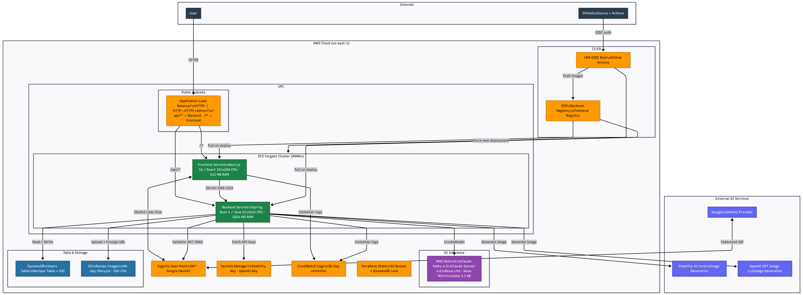

# Recipe AI Finder v2

> Turn a list of ingredients into three complete recipes — with AI-generated food photography — in seconds.


---

This application is live at

- https://recipe-ai-finder.com
- https://www.recipe-ai-finder.com


## What It Does

1. Sign in with Google via AWS Cognito
2. Enter the ingredients you have on hand and choose an AI model
3. The backend calls **AWS Bedrock** to generate exactly three recipes (title, description, ingredients, steps) as structured JSON
4. An image generation model (Stability AI or OpenAI) produces professional food photography for each recipe
5. Photos are stored in S3 and served via presigned URLs; recipes are persisted in DynamoDB
6. Browse, view, and delete your saved recipe collection

---

## AI & Model Layer

### Foundation Model Inference — AWS Bedrock

Recipe generation runs entirely through **AWS Bedrock Runtime**. The model is selected per-request from the frontend, allowing users to trade off speed vs. quality.

| Model | Bedrock ID | Characteristics |
|-------|-----------|-----------------|
| Claude Haiku 4.5 | `us.anthropic.claude-haiku-4-5-20251001-v1:0` | Fastest, lowest cost |
| Claude Sonnet 4.6 | `us.anthropic.claude-sonnet-4-6` | Best reasoning, highest quality |
| Amazon Nova Micro | `amazon.nova-micro-v1:0` | Ultra-fast AWS-native |
| Amazon Nova Lite | `amazon.nova-lite-v1:0` | Fast AWS-native with vision |
| Meta Llama 3.1 8B | `us.meta.llama3-1-8b-instruct-v1:0` | Open-source alternative |

**How it works:**
- Each model family gets a tailored prompt format: Anthropic models use the Messages API format; Nova/Titan models use the generic messages format; Llama 3.1 uses its special `<|begin_of_text|>` token syntax.
- The system prompt instructs the model to return a JSON array of exactly three recipe objects. A fallback parser strips any prose the model prepends or appends before JSON deserialization.
- AWS SDK v2 `BedrockRuntimeClient` with a 90-second read timeout handles long-running inference calls.

**Key file:** [backend/src/main/java/io/asbun/backend/service/BedrockService.java](backend/src/main/java/io/asbun/backend/service/BedrockService.java)

### Image Generation

After recipes are generated, the backend produces a food photography image for each one. Two providers are supported; the user selects one per session.

| Provider | Model | Notes |
|----------|-------|-------|
| **Stability AI Core** | `stable-image/generate/core` | Default; 1:1 aspect ratio |
| **OpenAI** | `gpt-image-1` | 1024×1024; high quality |

Both providers receive the same prompt template:
```
A beautiful food photography photo of {RECIPE_TITLE}, professional lighting, high quality, restaurant style
```

**Image lifecycle:**
1. Base64 PNG returned by the provider
2. Decoded and uploaded to S3 (`recipe-ai-{env}-recipe-images`)
3. Presigned URL (1-hour TTL) returned to the client alongside the recipe
4. S3 lifecycle policy auto-deletes images after 90 days
5. Image generation failures are non-blocking — recipes save successfully even if image generation fails

**Key file:** [backend/src/main/java/io/asbun/backend/service/ImageGenerationService.java](backend/src/main/java/io/asbun/backend/service/ImageGenerationService.java)

---

## Architecture



### Request Flow

```
POST /api/recipes/generate
  └─ ALB routes to Backend ECS service
      └─ BedrockService.generateRecipes()
          └─ BedrockRuntimeClient.invokeModel(selectedModel, ingredientPrompt)
              └─ Parse JSON → List<GenerateRecipeResponse>
      └─ ImageGenerationService.generateImage(recipeTitle) [async, non-blocking]
          └─ Stability AI / OpenAI → base64 PNG
          └─ S3Service.uploadImage() → S3 object
          └─ S3Presigner.presignGetObject() → 1-hour URL
      └─ Return recipes + image URLs to frontend
```

---

## Infrastructure

The entire AWS environment is defined in Terraform under [`/infrastructure`](infrastructure/) using a modular structure.

### AWS Services

| Service | Role |
|---------|------|
| **ECS Fargate** | Runs backend and frontend containers (ARM64, no EC2 to manage) |
| **Application Load Balancer** | HTTPS termination, HTTP→HTTPS redirect, path-based routing |
| **DynamoDB** | Serverless NoSQL; `PAY_PER_REQUEST` billing; GSI on `userId` for per-user recipe queries |
| **S3** | Image storage with SSE-AES256 encryption, versioning off, 90-day lifecycle |
| **Cognito** | User pool with Google as a federated identity provider; JWT-based sessions |
| **ECR** | Private container registries for backend and frontend images |
| **Secrets Manager** | Stores `STABILITY_API_KEY` and `OPENAI_API_KEY`; injected into ECS task definitions at runtime — never in code or environment files |
| **ACM** | TLS certificates for the load balancer |
| **CloudWatch** | Container logs; 30-day retention |

### Terraform Module Structure

```
infrastructure/
├── main.tf                  # Module orchestration
├── providers.tf             # S3 remote state + DynamoDB lock table
├── environments/
│   ├── dev.tfvars
│   └── prod.tfvars
└── modules/
    ├── networking/          # VPC, public/private subnets, IGW, route tables, security groups
    ├── alb/                 # ALB, target groups, HTTPS listener, path-based rules
    ├── ecs/                 # Cluster, task definitions, Fargate services
    ├── iam/                 # ECS execution role, ECS task role, GitHub Actions OIDC role
    ├── dynamodb/            # Users table + Recipes table with GSI
    ├── cognito/             # User pool, Google IdP, app client, hosted UI
    ├── s3/                  # Image bucket, encryption, lifecycle
    └── ecr/                 # Backend and frontend repositories
```

**Remote state:** Terraform state is stored in S3 (`recipe-ai-terraform-state`) with DynamoDB (`recipe-ai-terraform-locks`) for concurrency-safe locking.

### Security Design

- **Least-privilege IAM:** The ECS task role grants only `bedrock:InvokeModel`, `bedrock:InvokeModelWithResponseStream`, targeted DynamoDB actions, and S3 object operations on the specific bucket.
- **No static credentials:** GitHub Actions authenticates to AWS via OIDC — no long-lived access keys anywhere.
- **Secrets at runtime:** API keys are pulled from Secrets Manager by the ECS execution role and injected as environment variables; they never touch application code or version control.
- **JWT validation:** Spring Security validates Cognito-issued JWTs on every protected endpoint using the Cognito JWKS endpoint.

---

## CI/CD Pipeline

**File:** [.github/workflows/deploy.yml](.github/workflows/deploy.yml)

```
Trigger: push to main  OR  manual dispatch (select: dev | prod)
    │
    ├─ Configure AWS credentials via OIDC (no static keys)
    │
    ├─ Docker Buildx (linux/arm64)
    │   ├─ Build backend image  → ECR  :latest + :<git-sha>
    │   └─ Build frontend image → ECR  :latest + :<git-sha>
    │
    └─ Force new ECS deployment
        ├─ recipe-ai-{env}-backend
        └─ recipe-ai-{env}-frontend
```

---

## Tech Stack

| Layer | Technology | Version |
|-------|-----------|---------|
| Backend language | Java (Amazon Corretto) | 21 |
| Backend framework | Spring Boot | 4.0.5 |
| Frontend framework | Next.js | 16.2.1 |
| Frontend library | React | 19.2.4 |
| Styling | Tailwind CSS | 4 |
| AI inference | AWS Bedrock | — |
| Image generation | Stability AI + OpenAI | — |
| Authentication | AWS Cognito (Google OAuth2) | — |
| Database | AWS DynamoDB | — |
| Object storage | AWS S3 | — |
| Container runtime | AWS ECS Fargate (ARM64) | — |
| Load balancer | AWS ALB | — |
| IaC | Terraform | 1.7+ |
| CI/CD | GitHub Actions (OIDC) | — |
| AWS SDK | AWS SDK for Java v2 | 2.28.29 |

---

## Project Structure

```
recipe-ai-finder-v2/
├── backend/                          # Spring Boot 4 service
│   └── src/main/java/io/asbun/backend/
│       ├── config/                   # AwsConfig, DynamoDbConfig, SecurityConfig
│       ├── controller/               # RecipeController, ImageController, AuthController
│       ├── service/                  # BedrockService, ImageGenerationService, S3Service
│       ├── repository/               # RecipeRepository, UserRepository (DynamoDB)
│       └── model/                    # Recipe, User, DTOs, enums (BedrockModel, ImageModel)
├── frontend/                         # Next.js 16 app
│   └── app/
│       ├── (auth)/login/             # Google OAuth login page
│       ├── (protected)/dashboard/    # Ingredient input + model selection
│       ├── (protected)/generate/     # Generated recipe display
│       └── (protected)/recipes/      # Saved recipe gallery + detail view
├── infrastructure/                   # Terraform IaC
│   └── modules/                      # networking, alb, ecs, iam, dynamodb, cognito, s3, ecr
├── docker/
│   ├── backend.Dockerfile            # Multi-stage Maven → Corretto 21 Alpine
│   └── frontend.Dockerfile           # Multi-stage Node.js → Next.js standalone
└── .github/workflows/deploy.yml      # GitHub Actions CI/CD
```

---

## Local Development

### Prerequisites

- Java 21 (Amazon Corretto recommended)
- Node.js 22
- Maven 3.9+
- AWS CLI configured with credentials that have Bedrock and DynamoDB access
- An AWS Cognito User Pool (for auth)

### Backend

```bash
cd backend

# Copy and fill in local config
cp src/main/resources/application-local.properties.example \
   src/main/resources/application-local.properties

# Required variables in application-local.properties:
#   spring.security.oauth2.resourceserver.jwt.issuer-uri=<cognito-issuer>
#   stability.api-key=<your-key>
#   openai.api-key=<your-key>
#   aws.dynamodb.users-table=<table-name>
#   aws.dynamodb.recipes-table=<table-name>
#   aws.s3.bucket=<bucket-name>

mvn spring-boot:run -Plocal
# Runs on http://localhost:8080
```

### Frontend

```bash
cd frontend

cp .env.local.example .env.local

# Required variables:
#   NEXT_PUBLIC_COGNITO_DOMAIN=<your-cognito-domain>
#   NEXT_PUBLIC_COGNITO_CLIENT_ID=<app-client-id>
#   NEXT_PUBLIC_REDIRECT_URI=http://localhost:3000/api/auth/callback
#   BACKEND_URL=http://localhost:8080

npm install
npm run dev
# Runs on http://localhost:3000
```

### API Endpoints

| Method | Path | Description |
|--------|------|-------------|
| `GET` | `/api/health` | Health check (used by ALB) |
| `POST` | `/api/auth/user` | Upsert user from JWT claims |
| `POST` | `/api/recipes/generate` | Generate 3 recipes via Bedrock |
| `POST` | `/api/recipes` | Save a recipe to DynamoDB |
| `GET` | `/api/recipes` | List current user's recipes |
| `GET` | `/api/recipes/{id}` | Get single recipe |
| `DELETE` | `/api/recipes/{id}` | Delete recipe |
| `POST` | `/api/images/upload` | Upload image to S3 |
