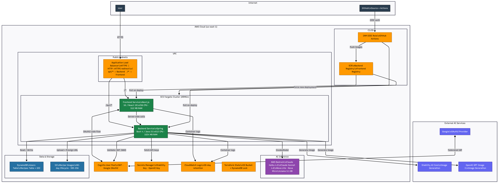

# Recipe AI Finder v2

> Turn a list of ingredients into three complete recipes — with AI-generated food photography — in seconds.


---

This application is live at

- https://recipe-ai-finder.com
- https://www.recipe-ai-finder.com

---

## Try It Out

A demo account is available so you can explore the app without creating your own credentials:

| Field        | Value                |
| ------------ | -------------------- |
| **Email**    | `testuser1@mail.com` |
| **Password** | `TestUserPassword1$` |

> This account is limited to **20 AI recipe generations** to prevent abuse of the underlying Bedrock and image generation APIs. All other features (browsing, saving, and deleting recipes) are fully accessible.

---

## What It Does

1. Sign in with Google via AWS Cognito
2. Enter the ingredients you have on hand and choose an AI model
3. The backend calls **AWS Bedrock** to generate exactly three recipes (title, description, ingredients, steps) as structured JSON
4. An image generation model (Stability AI, OpenAI, or Google Imagen) produces professional food photography for each recipe
5. Photos are stored in S3 and served via presigned URLs; recipes are persisted in DynamoDB
6. Browse, view, and delete your saved recipe collection
7. Set your **dietary restrictions** in Account Settings — every recipe generated afterwards is guaranteed to comply
8. Visit the **Model Stats** page to see aggregated performance charts across all users — average image and text generation times per model, sample counts, and a 30-day trend line

---

## AI & Model Layer

### Foundation Model Inference — AWS Bedrock

Recipe generation runs entirely through **AWS Bedrock Runtime**. The model is selected per-request from the frontend, allowing users to trade off speed vs. quality.

| Model             | Bedrock ID                                    | Characteristics                 |
| ----------------- | --------------------------------------------- | ------------------------------- |
| Claude Haiku 4.5  | `us.anthropic.claude-haiku-4-5-20251001-v1:0` | Fastest, lowest cost            |
| Claude Sonnet 4.6 | `us.anthropic.claude-sonnet-4-6`              | Best reasoning, highest quality |
| Amazon Nova Micro | `amazon.nova-micro-v1:0`                      | Ultra-fast AWS-native           |
| Amazon Nova Lite  | `amazon.nova-lite-v1:0`                       | Fast AWS-native with vision     |
| Meta Llama 3.1 8B | `us.meta.llama3-1-8b-instruct-v1:0`           | Open-source alternative         |

**How it works:**

- Each model family gets a tailored prompt format: Anthropic models use the Messages API format; Nova/Titan models use the generic messages format; Llama 3.1 uses its special `<|begin_of_text|>` token syntax.
- The system prompt instructs the model to return a JSON array of exactly three recipe objects. A fallback parser strips any prose the model prepends or appends before JSON deserialization.
- AWS SDK v2 `BedrockRuntimeClient` with a 90-second read timeout handles long-running inference calls.

**Key file:** [backend/src/main/java/io/asbun/backend/service/BedrockService.java](backend/src/main/java/io/asbun/backend/service/BedrockService.java)

### Image Generation

After recipes are generated, the backend produces a food photography image for each one. Three providers are supported; the user selects one per session.

| Provider                 | Model ID                       | Notes                             |
| ------------------------ | ------------------------------ | --------------------------------- |
| **Stability AI Core**    | `stable-image/generate/core`   | 1:1 aspect ratio                  |
| **OpenAI**               | `gpt-image-1.5`                | 1024×1024; high quality           |
| **Google Imagen 4**      | `imagen-4.0-generate-001`      | 1:1 aspect ratio; highest quality |
| **Google Imagen 4 Fast** | `imagen-4.0-fast-generate-001` | 1:1 aspect ratio; lower latency   |

Both providers receive the same prompt template:

```
A beautiful food photography photo of {RECIPE_TITLE}, professional lighting, high quality, restaurant style
```

**Image lifecycle:**

1. Base64 PNG returned by the provider
2. Decoded and uploaded to S3 (`recipe-ai-{env}-recipe-images`)
3. Presigned URL (1-hour TTL) generated on read and served once the image is available
4. S3 lifecycle policy auto-deletes images after 90 days
5. Image generation runs asynchronously in a background thread — recipes are saved immediately with `imageUrl: null`, which is populated once generation completes. Generation is retried up to 3 times with exponential backoff (2 s, 4 s) before giving up; if all attempts fail, the recipe remains accessible without an image.
6. The frontend opens a **Server-Sent Events** connection to `GET /api/recipes/{id}/image-stream` immediately after saving. The backend holds the connection open via `SseEmitter` and fires an `image-ready` event as soon as the image URL is written to DynamoDB, at which point the frontend fetches the updated recipe and renders the image — no polling required.

**Key file:** [backend/src/main/java/io/asbun/backend/service/ImageGenerationService.java](backend/src/main/java/io/asbun/backend/service/ImageGenerationService.java)

---

## Model Stats

The `/model-stats` page surfaces aggregated performance data across all users, visualized with three [Recharts](https://recharts.org) charts:

| Chart                              | What it shows                                                          |
| ---------------------------------- | ---------------------------------------------------------------------- |
| **Image Generation Time by Model** | Average `imageGenerationMs` per image model (bar chart, 4 bars)        |
| **Text Generation Time by Model**  | Average `textGenerationMs` per Bedrock model (bar chart, 5 bars)       |
| **Image Generation Trend**         | Daily average image generation time over the last 30 days (line chart) |

Each bar tooltip also shows the sample count (number of recipes) used to compute the average.

### Data pipeline

Stats are computed by scanning the entire `Recipes` DynamoDB table, grouping by model, and averaging the recorded `imageGenerationMs` / `textGenerationMs` fields that are stored on every recipe at save time. Results are cached in DynamoDB under a sentinel item (`recipeId = STATS#MODEL_AVERAGES`) with a 1-hour TTL, so at most one full scan runs per hour regardless of page traffic.

### SSE-based delivery

The page uses **Server-Sent Events** rather than a blocking fetch, so it never shows an error on a cache miss (e.g. first deployment, expired cache):

```
Browser → GET /api/backend/api/stats/stream (EventSource)
    │
    └─ Next.js middleware injects Authorization: Bearer <token> from session cookie
        └─ StatsController.streamStats()
            ├─ cache FRESH  → StatsSseService.sendToEmitter()  ← stats arrive in ~5 ms
            └─ cache STALE  → StatsService.computeAndNotifyAsync() [@Async]
                                 └─ DynamoDB full scan → compute averages
                                 └─ StatsSseService.broadcastStats() ← pushes to all waiting clients
```

The frontend renders three pulsing skeleton cards while waiting and swaps them for the live charts the moment the `stats-ready` SSE event arrives — no polling, no page reload required.

**Key files:**

- [backend/.../service/StatsService.java](backend/src/main/java/io/asbun/backend/service/StatsService.java)
- [backend/.../service/StatsSseService.java](backend/src/main/java/io/asbun/backend/service/StatsSseService.java)
- [backend/.../repository/StatsRepository.java](backend/src/main/java/io/asbun/backend/repository/StatsRepository.java)
- [frontend/app/(protected)/model-stats/ModelStatsLoader.tsx](<frontend/app/(protected)/model-stats/ModelStatsLoader.tsx>)
- [frontend/app/(protected)/model-stats/ModelStatsChart.tsx](<frontend/app/(protected)/model-stats/ModelStatsChart.tsx>)

---

## Dietary Restrictions

Users can save a set of dietary restrictions to their profile, and every recipe generated afterwards is guaranteed to comply. Restrictions are managed at `/account/dietary` and surfaced on the dashboard so they're always visible.

### Supported restrictions

Ten restrictions are supported. The canonical list lives in the backend enum ([`DietaryRestriction`](backend/src/main/java/io/asbun/backend/model/enums/DietaryRestriction.java)) and is mirrored on the frontend ([`lib/dietary.ts`](frontend/lib/dietary.ts)):

| Value          | Label       |
| -------------- | ----------- |
| `GLUTEN_FREE`  | Gluten-Free |
| `KETO`         | Keto        |
| `VEGAN`        | Vegan       |
| `VEGETARIAN`   | Vegetarian  |
| `DAIRY_FREE`   | Dairy-Free  |
| `NUT_FREE`     | Nut-Free    |
| `PALEO`        | Paleo       |
| `LOW_CARB`     | Low-Carb    |
| `HALAL`        | Halal       |
| `KOSHER`       | Kosher      |

### Persistence & API

Restrictions are stored as a `List<String>` on the `User` item in DynamoDB and exposed through the account API:

| Method | Path                                | Description                                        |
| ------ | ----------------------------------- | -------------------------------------------------- |
| `GET`  | `/api/account/dietary-restrictions` | Return the current user's saved restrictions       |
| `PUT`  | `/api/account/dietary-restrictions` | Replace the saved restrictions with a new list     |

The `PUT` payload is validated on both sides:

- **Server:** [`UpdateDietaryRestrictionsRequest`](backend/src/main/java/io/asbun/backend/dto/UpdateDietaryRestrictionsRequest.java) enforces `@NotNull` and `@Size(max = 10)`; the controller rejects values outside the supported enum with a `400`, and de-duplicates the list before saving.
- **Client:** the selector at `/account/dietary` only offers the ten supported values, and the dashboard shows the active restrictions (or a "None set" state) with a link to edit.

The current user's restrictions are also included in the profile response (`GET /api/account/profile`), which the dashboard uses to render its badges.

### AI enforcement

When restrictions are set, they are injected into the Bedrock prompt so the model is constrained at generation time — not filtered afterwards. On `POST /api/recipes/generate`, [`RecipeController`](backend/src/main/java/io/asbun/backend/controller/RecipeController.java) loads the user's saved restrictions and passes them to [`BedrockService.generateRecipes()`](backend/src/main/java/io/asbun/backend/service/BedrockService.java), which:

1. Adds an explicit dietary-constraints clause listing the restrictions by display name and instructing the model that every recipe **must** fully comply.
2. Qualifies the "pantry staples" permission (flour, butter, soy sauce, etc.) so that any dietary restriction always overrides it — preventing contradictory instructions such as suggesting flour to a gluten-free user.

When a user has no restrictions, the clause is omitted entirely and generation behaves exactly as before.

**Key files:**

- [backend/.../controller/AccountController.java](backend/src/main/java/io/asbun/backend/controller/AccountController.java) — dietary restriction endpoints
- [backend/.../service/BedrockService.java](backend/src/main/java/io/asbun/backend/service/BedrockService.java) — prompt injection & enforcement
- [backend/.../model/enums/DietaryRestriction.java](backend/src/main/java/io/asbun/backend/model/enums/DietaryRestriction.java) — supported values
- [frontend/app/(protected)/account/dietary/page.tsx](<frontend/app/(protected)/account/dietary/page.tsx>) — restriction selection UI
- [frontend/lib/dietary.ts](frontend/lib/dietary.ts) — shared restriction types & labels

---

## Architecture



### Request Flow

```
POST /api/recipes/generate
  └─ ALB routes to Backend ECS service
      └─ BedrockService.generateRecipes()
          └─ BedrockRuntimeClient.invokeModel(selectedModel, ingredientPrompt)
              └─ Parse JSON → List<GenerateRecipeResponse>
      └─ RecipeRepository.save(recipe)              ← immediate, imageUrl=null
      └─ Return recipe to frontend (imageUrl=null)
      └─ AsyncImageService [background thread]
          └─ ImageGenerationService.generateAndUploadImage() [retries up to 3×, 2s/4s backoff]
              └─ Stability AI / OpenAI / Google Imagen → base64 PNG
              └─ S3Service.uploadImage() → S3 object
          └─ RecipeRepository.save(recipe)          ← updates imageUrl
          └─ ImageSseService.notifyImageReady()     ← fires SSE event to waiting frontend

GET /api/stats/stream  (SSE)
  └─ StatsController.streamStats()
      ├─ cache FRESH (< 1 hr old)
      │   └─ StatsSseService.sendToEmitter()        ← immediate stats-ready event (~5 ms)
      └─ cache STALE / missing
          └─ StatsService.computeAndNotifyAsync()   ← @Async background thread
              └─ StatsRepository.scanAllRecipes()   ← full DynamoDB scan
              └─ compute per-model averages + 30-day daily buckets
              └─ StatsRepository.saveStats()        ← writes STATS#MODEL_AVERAGES sentinel item
              └─ StatsSseService.broadcastStats()   ← fires stats-ready to all waiting clients
```

---

## Infrastructure

The entire AWS environment is defined in Terraform under [`/infrastructure`](infrastructure/) using a modular structure.

### AWS Services

| Service                       | Role                                                                                                                                                   |
| ----------------------------- | ------------------------------------------------------------------------------------------------------------------------------------------------------ |
| **ECS Fargate**               | Runs backend and frontend containers (ARM64, no EC2 to manage)                                                                                         |
| **Application Load Balancer** | HTTPS termination, HTTP→HTTPS redirect, path-based routing                                                                                             |
| **DynamoDB**                  | Serverless NoSQL; `PAY_PER_REQUEST` billing; GSI on `userId` for per-user recipe queries                                                               |
| **S3**                        | Image storage with SSE-AES256 encryption, versioning off, 90-day lifecycle                                                                             |
| **Cognito**                   | User pool with Google as a federated identity provider; JWT-based sessions                                                                             |
| **ECR**                       | Private container registries for backend and frontend images                                                                                           |
| **Secrets Manager**           | Stores `STABILITY_API_KEY`, `OPENAI_API_KEY`, and `GOOGLE_API_KEY`; injected into ECS task definitions at runtime — never in code or environment files |
| **ACM**                       | TLS certificates for the load balancer                                                                                                                 |
| **CloudWatch**                | Container logs; 30-day retention                                                                                                                       |

### Terraform Module Structure

```
infrastructure/
├── main.tf                  # Module orchestration
├── providers.tf             # S3 remote state + DynamoDB lock table
├── environments/
│   ├── dev.tfvars
│   └── prod.tfvars
└── modules/
    ├── networking/          # VPC, public/private subnets, IGW, route tables, security groups
    ├── alb/                 # ALB, target groups, HTTPS listener, path-based rules
    ├── ecs/                 # Cluster, task definitions, Fargate services
    ├── iam/                 # ECS execution role, ECS task role, GitHub Actions OIDC role
    ├── dynamodb/            # Users table + Recipes table with GSI
    ├── cognito/             # User pool, Google IdP, app client, hosted UI
    ├── s3/                  # Image bucket, encryption, lifecycle
    ├── ecr/                 # Backend and frontend repositories
    └── waf/                 # AWS WAF Web ACL, IP sets, rate limits, logging, monitoring
```

**Remote state:** Terraform state is stored in S3 (`recipe-ai-terraform-state`) with DynamoDB (`recipe-ai-terraform-locks`) for concurrency-safe locking.

### Security Design

- **Least-privilege IAM:** The ECS task role grants only `bedrock:InvokeModel`, `bedrock:InvokeModelWithResponseStream`, targeted DynamoDB actions, and S3 object operations on the specific bucket.
- **No static credentials:** GitHub Actions authenticates to AWS via OIDC — no long-lived access keys anywhere.
- **Secrets at runtime:** API keys are pulled from Secrets Manager by the ECS execution role and injected as environment variables; they never touch application code or version control.
- **JWT validation:** Spring Security validates Cognito-issued JWTs on every protected endpoint using the Cognito JWKS endpoint.

---

### AWS WAF (Web Application Firewall)

A regional WAF Web ACL is attached to the ALB, inspecting every inbound HTTP request before it reaches the application. The WAF module lives at [`infrastructure/modules/waf/`](infrastructure/modules/waf/) and deploys as part of the main Terraform root.

**Protection layers (evaluated in priority order):**

| Priority | Rule | What it does |
|----------|------|-------------|
| 0 | IP Allow-List | Bypass all rules for trusted IPs (IPv4 + IPv6) |
| 1 | IP Block-List | Immediately reject known-bad IPs |
| 2 | Health Endpoint Bypass | `GET /api/health` always passes through |
| 3 | Geo Restriction | Block entire countries (disabled by default) |
| 4 | Bot Control (AWS Managed) | Identifies and blocks unverified bots, scrapers, and automated tools |
| 5 | Auth Rate Limit | 100 req/5 min per IP on `POST /api/auth/*` — brute-force protection |
| 6 | Recipe Gen Rate Limit | 100 req/5 min per IP on `POST /api/recipes/generate` — cost abuse prevention |
| 7 | Image Upload Rate Limit | 100 req/5 min per IP on `POST /api/images/upload` — storage abuse prevention |
| 8 | Global Rate Limit | 1000 req/5 min per IP across all endpoints |
| 9 | IP Reputation (AWS Managed) | Auto-blocks IPs from known botnets, scanners, and malicious hosts |
| 10 | Common Rule Set (AWS Managed) | Blocks SQLi, XSS, path traversal, and OWASP Top 10 attacks |
| 11 | Known Bad Inputs (AWS Managed) | Blocks Log4j, Spring4Shell, and other known exploit payloads |

**Key design decisions:**
- Rate-based rules use `FORWARDED_IP` (X-Forwarded-For header) so clients behind proxies are correctly identified
- Managed rule groups auto-update — no version pinning — so new threat signatures apply immediately
- All blocked requests are logged to S3 (`aws-waf-logs-recipe-ai-{env}`) with 90-day retention
- CloudWatch alarm fires when blocked requests spike above threshold
- IP allow/block lists and geo-restrictions are configurable via `tfvars` without code changes

---

## CI/CD Pipeline

**File:** [.github/workflows/deploy.yml](.github/workflows/deploy.yml)

```
Trigger: push to main  OR  manual dispatch (select: dev | prod)
    │
    ├─ Configure AWS credentials via OIDC (no static keys)
    │
    ├─ Docker Buildx (linux/arm64)
    │   ├─ Build backend image  → ECR  :latest + :<git-sha>
    │   └─ Build frontend image → ECR  :latest + :<git-sha>
    │
    └─ Force new ECS deployment
        ├─ recipe-ai-{env}-backend
        └─ recipe-ai-{env}-frontend
```

---

## Tech Stack

| Layer              | Technology                            | Version |
| ------------------ | ------------------------------------- | ------- |
| Backend language   | Java (Amazon Corretto)                | 21      |
| Backend framework  | Spring Boot                           | 4.0.5   |
| Frontend framework | Next.js                               | 16.2.1  |
| Frontend library   | React                                 | 19.2.4  |
| Styling            | Tailwind CSS                          | 4       |
| Charts             | Recharts                              | 3       |
| AI inference       | AWS Bedrock                           | —       |
| Image generation   | Stability AI + OpenAI + Google Imagen | —       |
| Authentication     | AWS Cognito (Google OAuth2)           | —       |
| Database           | AWS DynamoDB                          | —       |
| Object storage     | AWS S3                                | —       |
| Container runtime  | AWS ECS Fargate (ARM64)               | —       |
| Load balancer      | AWS ALB                               | —       |
| Web firewall       | AWS WAF v2                            | —       |
| IaC                | Terraform                             | 1.7+    |
| CI/CD              | GitHub Actions (OIDC)                 | —       |
| AWS SDK            | AWS SDK for Java v2                   | 2.28.29 |

---

## Project Structure

```
recipe-ai-finder-v2/
├── backend/                          # Spring Boot 4 service
│   └── src/main/java/io/asbun/backend/
│       ├── config/                   # AwsConfig, DynamoDbConfig, SecurityConfig, AsyncConfig
│       ├── controller/               # RecipeController, ImageController, AuthController, StatsController
│       ├── service/                  # BedrockService, ImageGenerationService, S3Service, AsyncImageService, ImageSseService, StatsService, StatsSseService
│       ├── repository/               # RecipeRepository, UserRepository, StatsRepository (DynamoDB)
│       └── model/                    # Recipe, User, DTOs, enums (BedrockModel, ImageModel)
├── frontend/                         # Next.js 16 app
│   └── app/
│       ├── (auth)/login/             # Google OAuth login page
│       ├── (protected)/dashboard/    # Ingredient input + model selection
│       ├── (protected)/generate/     # Generated recipe display
│       ├── (protected)/recipes/      # Saved recipe gallery + detail view
│       └── (protected)/model-stats/  # Model performance charts (SSE-loaded)
├── infrastructure/                   # Terraform IaC
│   └── modules/                      # networking, alb, ecs, iam, dynamodb, cognito, s3, ecr
├── docker/
│   ├── backend.Dockerfile            # Multi-stage Maven → Corretto 21 Alpine
│   └── frontend.Dockerfile           # Multi-stage Node.js → Next.js standalone
└── .github/workflows/deploy.yml      # GitHub Actions CI/CD
```

---

## Local Development

### Prerequisites

- Java 21 (Amazon Corretto recommended)
- Node.js 22
- Maven 3.9+
- AWS CLI configured with credentials that have Bedrock and DynamoDB access
- An AWS Cognito User Pool (for auth)

### Backend

```bash
cd backend

# Copy and fill in local config

cd src/main/resources/application-local.properties

Required variables in application-local.properties:

# COGNITO_ISSUER_URI=
# dynamodb.users-table=
# dynamodb.recipes-table=
# S3_BUCKET=
# STABILITY_API_KEY=
# OPENAI_API_KEY=
# GOOGLE_API_KEY=

./mvnw spring-boot:run -Dspring-boot.run.profiles=local
# Runs on http://localhost:8080
```

### Frontend

```bash
cd frontend

cd .env.local.example .env.local

# Required variables:
# COGNITO_DOMAIN=
# COGNITO_CLIENT_ID=

npm install
npm run dev
# Runs on http://localhost:3000
```

### API Endpoints

| Method   | Path                             | Description                                                                                           |
| -------- | -------------------------------- | ----------------------------------------------------------------------------------------------------- |
| `GET`    | `/api/health`                    | Health check (used by ALB)                                                                            |
| `POST`   | `/api/auth/user`                 | Upsert user from JWT claims                                                                           |
| `POST`   | `/api/recipes/generate`          | Generate 3 recipes via Bedrock                                                                        |
| `POST`   | `/api/recipes`                   | Save a recipe to DynamoDB                                                                             |
| `GET`    | `/api/recipes`                   | List current user's recipes                                                                           |
| `GET`    | `/api/recipes/{id}`              | Get single recipe                                                                                     |
| `GET`    | `/api/recipes/{id}/image-stream` | SSE stream — fires `image-ready` event when image generation completes                                |
| `DELETE` | `/api/recipes/{id}`              | Delete recipe                                                                                         |
| `POST`   | `/api/images/upload`             | Upload image to S3                                                                                    |
| `GET`    | `/api/account/profile`           | Get current user's profile (includes saved dietary restrictions)                                     |
| `GET`    | `/api/account/dietary-restrictions` | Get current user's saved dietary restrictions                                                      |
| `PUT`    | `/api/account/dietary-restrictions` | Replace the current user's dietary restrictions (max 10, validated)                                |
| `GET`    | `/api/stats/models`              | Return cached model performance stats (JSON)                                                          |
| `GET`    | `/api/stats/stream`              | SSE stream — fires `stats-ready` event with full stats JSON; triggers async computation on cache miss |
