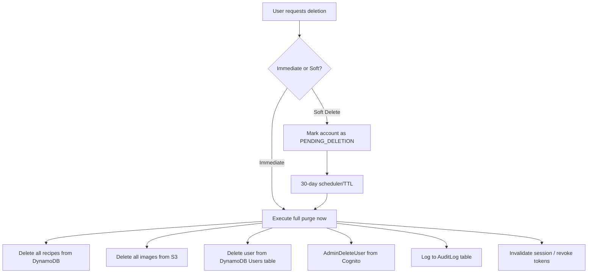

## Implementation Plan — Security & Legal Compliance Package

**Problem Statement:**
The Recipe AI Finder app currently has no account deletion, data export, privacy policy, consent management, audit logging, or rate limiting. This plan brings the application into compliance with GDPR, CCPA/CPRA, and Brazil's LGPD by implementing the full set of technical and UX features required.

**Requirements:**
- Global compliance (GDPR + CCPA + LGPD)
- Full compliance package: deletion, export, privacy policy, consent, audit logging, data retention
- Account deletion: soft delete with 30-day grace period by default, with option for immediate permanent deletion
- Delete from all stores including Cognito
- Data export: JSON-only (quick) or full ZIP with images (async)
- Audit logging: DynamoDB for user-facing trail + CloudWatch for ops/legal
- Consent framework: single blocking modal on first login with checkboxes for each required consent (ToS, Privacy Policy, AI Data Processing). Pluggable for future analytics opt-in.
- Rate limiting on all API endpoints
- Privacy policy and ToS as template pages (lawyer review recommended before going live)

**Background — Current Data Footprint:**

| Store | Data | Deletion Needed |
|---|---|---|
| DynamoDB `Users` table | userId, email, username, createdAt, generateCallsUsed | Delete row |
| DynamoDB `Recipes` table | All recipes (userId GSI) | Delete all user's recipes |
| S3 `recipe-images` bucket | Image files referenced by recipe.imageUrl | Delete all user's image objects |
| AWS Cognito User Pool | Auth identity (email, Google sub) | AdminDeleteUser API call |
| CloudWatch Logs | May contain userId in request logs | Accept (logs have 30-day retention already) |
| Stats cache (STATS#MODEL_AVERAGES) | Aggregated, no PII | No action needed |

**Proposed Solution:**

A layered approach adding: (1) new DynamoDB `AuditLog` + `Consent` tables, (2) backend services for account lifecycle management, data export, consent, and rate limiting, (3) infrastructure changes for IAM permissions and new tables, (4) frontend pages for account settings, privacy policy, consent modal, and data export.

---

**Task Breakdown:**

**Task 1: Add DynamoDB Audit Log and Consent tables via Terraform**

- Objective: Create the infrastructure for audit logging and consent records.
- Implementation guidance:
  - Add `AuditLog` table to `infrastructure/modules/dynamodb/main.tf` with partition key `auditId` (String), GSI on `userId`, and a TTL attribute for optional auto-expiry of old records.
  - Add `Consent` table with partition key `userId` (String) and sort key `consentType` (String) to track granular consent records.
  - Add `cognito-idp:AdminDeleteUser` and `cognito-idp:AdminDisableUser` permissions to the ECS task role in `infrastructure/modules/iam/main.tf`.
- Test requirements: `terraform plan` succeeds with no errors.
- Demo: New tables visible in Terraform plan output, IAM policy includes Cognito admin permissions.

**Task 2: Backend — Rate limiting filter**

- Objective: Add API rate limiting to protect all endpoints, especially compliance-sensitive ones.
- Implementation guidance:
  - Add `bucket4j-spring-boot-starter` dependency to `pom.xml` (or implement a simple in-memory token bucket filter since the app runs single-instance on Fargate).
  - Create a `RateLimitFilter` that limits per-user (extracted from JWT `sub` claim): e.g., 60 requests/minute general, 5 requests/hour for deletion/export endpoints.
  - Return HTTP 429 with `Retry-After` header when exceeded.
  - Add rate limit configuration to `application.properties`.
- Test requirements: Unit test verifying that exceeding the limit returns 429; test that different users have independent limits.
- Demo: Hit an endpoint repeatedly and observe 429 responses after threshold.

**Task 3: Backend — Consent service and API**

- Objective: Implement consent recording, retrieval, and validation.
- Implementation guidance:
  - Create `Consent` model (userId, consentType, granted boolean, grantedAt, revokedAt, version, ipAddress).
  - Create `ConsentRepository` for DynamoDB operations.
  - Create `ConsentService` with methods: `grantConsent()`, `revokeConsent()`, `getConsents()`, `hasRequiredConsent()`.
  - Create `ConsentController` with endpoints: `POST /api/consent` (grant), `DELETE /api/consent/{type}` (revoke), `GET /api/consent` (list user's consents).
  - Define consent types enum: `DATA_PROCESSING`, `AI_THIRD_PARTY`, `TERMS_OF_SERVICE`, `ANALYTICS` (future).
  - Add a check in the recipe generation flow that verifies `DATA_PROCESSING` and `AI_THIRD_PARTY` consent before calling Bedrock/image APIs.
- Test requirements: Unit tests for grant/revoke logic; integration test verifying recipe generation is blocked without consent.
- Demo: API calls to grant and list consents; recipe generation fails gracefully when consent is missing.

**Task 4: Backend — Audit logging service**

- Objective: Record compliance-relevant events to both DynamoDB and CloudWatch.
- Implementation guidance:
  - Create `AuditEvent` model (auditId, userId, eventType, details map, timestamp, ipAddress, userAgent).
  - Create `AuditRepository` for DynamoDB persistence.
  - Create `AuditService` that writes to DynamoDB AND logs structured JSON to a dedicated logger (for CloudWatch).
  - Define event types enum: `ACCOUNT_DELETION_REQUESTED`, `ACCOUNT_DELETION_COMPLETED`, `DATA_EXPORT_REQUESTED`, `DATA_EXPORT_COMPLETED`, `CONSENT_GRANTED`, `CONSENT_REVOKED`, `ACCOUNT_REACTIVATED`.
  - Wire audit calls into consent service (Task 3 gets updated to call audit on grant/revoke).
- Test requirements: Unit test verifying events are persisted; verify structured log output format.
- Demo: Grant a consent and observe both the DynamoDB audit record and CloudWatch JSON log entry.

**Task 5: Backend — Account deletion service (soft delete + immediate)**

- Objective: Implement the full account deletion lifecycle.
- Implementation guidance:
  - Add `accountStatus` field to `User` model (enum: `ACTIVE`, `PENDING_DELETION`, `DELETED`).
  - Add `deletionRequestedAt` and `scheduledDeletionDate` fields to User model.
  - Create `AccountDeletionService` with methods:
    - `requestSoftDeletion(userId)` — marks user as `PENDING_DELETION`, sets scheduledDeletionDate = now + 30 days.
    - `cancelDeletion(userId)` — reverts to `ACTIVE` if still within grace period.
    - `executeHardDeletion(userId)` — orchestrates full purge across all stores.
    - `processPendingDeletions()` — scheduled job that finds and executes overdue soft deletes.
  - `executeHardDeletion` must: (1) query all recipes by userId, (2) delete each recipe's S3 image, (3) batch-delete all recipes from DynamoDB, (4) delete user from Users table, (5) call Cognito `AdminDeleteUser`, (6) log audit event.
  - Add `CognitoIdentityProviderClient` to `AwsConfig` (new AWS SDK dependency: `cognitoidentityprovider`).
  - Create `AccountController` with endpoints: `POST /api/account/delete` (body: `{type: "soft"|"immediate"}`), `POST /api/account/cancel-deletion`.
  - Add a `@Scheduled` method that runs daily to process pending deletions past their grace period.
- Test requirements: Unit tests for soft delete state transitions; test that hard delete removes from all stores (mock AWS clients); test cancellation within grace period; test that `PENDING_DELETION` users are blocked from generating new recipes.
- Demo: Request soft deletion, verify user status changes; cancel it; request immediate deletion, verify all data is gone from DynamoDB.

**Task 6: Backend — Data export service**

- Objective: Allow users to export all their data in JSON or ZIP format.
- Implementation guidance:
  - Create `DataExportService` with methods:
    - `exportJson(userId)` — returns a JSON object containing user profile + all recipes (without presigned URLs, but with S3 keys).
    - `exportZipAsync(userId)` — generates a ZIP containing `data.json` + all recipe images downloaded from S3. Upload ZIP to a temp S3 location, return a presigned download URL.
  - Create `DataExportController`: `GET /api/account/export?format=json` (synchronous), `POST /api/account/export?format=zip` (returns 202 Accepted), `GET /api/account/export/status` (check if ZIP is ready).
  - Use `@Async` for ZIP generation (same pattern as image generation).
  - Apply strict rate limiting: 1 export per hour per user.
  - Log audit event on export request.
- Test requirements: Unit test that JSON export includes all user data; test ZIP contains expected files; test rate limit blocks rapid re-export.
- Demo: Call JSON export and receive complete user data; request ZIP export and download it.

**Task 7: Frontend — Consent modal on first login**

- Objective: Show a single blocking modal with checkboxes that prevents app usage until required consents are granted.
- Implementation guidance:
  - Create a `ConsentModal` component with individual checkboxes for:
    - ☐ "I agree to the Terms of Service" (link to /terms)
    - ☐ "I have read and understand the Privacy Policy" (link to /privacy)
    - ☐ "I consent to my data being processed by third-party AI models (AWS Bedrock, Stability AI, OpenAI, Google Imagen) to generate recipes and images"
  - "Accept & Continue" button enabled only when all required checkboxes are checked.
  - On first login (or when consent records are missing from `GET /api/consent`), show the modal before rendering protected pages.
  - Call `POST /api/consent` for each granted consent type.
  - Store consent state in session so the modal doesn't flash on every navigation.
  - Modal is not dismissible without granting required consents.
- Test requirements: Verify modal appears when no consent is recorded; verify it doesn't appear after consent is granted; verify app is blocked without consent.
- Demo: New user logs in, sees consent modal, grants consent, proceeds to dashboard normally.

**Task 8: Frontend — Account settings page**

- Objective: Create a user-facing page for account management including deletion and data export.
- Implementation guidance:
  - Create `/app/(protected)/account/page.tsx` with sections:
    - **Profile info** — display email, username, account creation date.
    - **Consent management** — show current consents with toggle for optional ones (analytics).
    - **Data export** — buttons for JSON download and ZIP export (with loading/progress states).
    - **Delete account** — two options clearly explained: "Schedule deletion (30-day grace period)" and "Delete immediately (irreversible)". Require typing "DELETE" to confirm immediate deletion.
  - Add account settings link to the Header/navigation component.
  - Show banner on all pages if account is in `PENDING_DELETION` state with option to cancel.
- Test requirements: Verify deletion confirmation flow prevents accidental deletion; verify export triggers download.
- Demo: Navigate to account settings, view profile, trigger JSON export download, initiate and cancel soft deletion.

**Task 9: Frontend — Privacy policy and Terms of Service pages**

- Objective: Add publicly accessible legal pages.
- Implementation guidance:
  - Create `/app/(public)/privacy/page.tsx` with GDPR/CCPA/LGPD-compliant privacy policy template covering: what data is collected, how it's used, third-party processors (AWS, Stability AI, OpenAI, Google), retention periods (90-day image lifecycle, 30-day logs), user rights (access, rectification, erasure, portability, objection), contact info placeholder, DPO placeholder.
  - Create `/app/(public)/terms/page.tsx` with Terms of Service template.
  - These pages should be publicly accessible (no auth required).
  - Add footer links to privacy policy and ToS on all pages (both auth and protected layouts).
  - Include last-updated date and version number on each page.
- Test requirements: Pages render correctly; links are accessible from all layouts; no auth required.
- Demo: Visit privacy policy and ToS pages without being logged in; verify comprehensive coverage of required legal disclosures.

**Task 10: Infrastructure — Scheduled deletion support**

- Objective: Ensure the scheduled job that processes pending account deletions is reliable.
- Implementation guidance:
  - Use Spring's `@Scheduled` annotation with a daily cron in `AccountDeletionService` (already implemented in Task 5).
  - Add a GSI on the Users table for `accountStatus` to efficiently query `PENDING_DELETION` users (or use a DynamoDB scan with filter since user count is small).
  - Ensure the scheduled job is idempotent (safe to run multiple times).
  - Add CloudWatch alarm for failed deletion attempts (optional but recommended).
- Test requirements: Unit test that the scheduler correctly identifies overdue accounts; test idempotency.
- Demo: Set a user's `scheduledDeletionDate` to the past, trigger the scheduler manually, verify full deletion executes.

**Task 11: Security hardening — Input validation, CORS tightening, and security headers**

- Objective: Harden the application against common security vulnerabilities.
- Implementation guidance:
  - Add `@Valid` annotations and request DTOs with Bean Validation constraints on all controller inputs (max lengths, patterns, etc.).
  - Tighten CORS configuration to only allow the specific production domain (currently may be permissive for local dev).
  - Add security headers via Spring Security: `X-Content-Type-Options: nosniff`, `X-Frame-Options: DENY`, `Strict-Transport-Security`, `Content-Security-Policy`.
  - Add `@JsonIgnoreProperties(ignoreUnknown = true)` to DTOs to prevent mass assignment.
  - Verify all endpoints check `userId` ownership (already done for recipes, ensure consistency).
  - Add request size limits to prevent payload abuse.
- Test requirements: Test that invalid inputs are rejected with 400; test security headers are present in responses; test that oversized requests are rejected.
- Demo: Send malformed/oversized requests and observe proper rejection; inspect response headers.

**Task 12: Integration testing and end-to-end verification**

- Objective: Verify the entire compliance flow works end-to-end.
- Implementation guidance:
  - Write integration tests (using Spring Boot test with mocked AWS clients) covering:
    - Full account lifecycle: create → consent → use app → request soft deletion → cancel → request immediate deletion → verify all data gone.
    - Data export contains all expected data.
    - Consent flow blocks recipe generation when missing.
    - Rate limiting works across all compliance endpoints.
    - Audit log contains expected entries for all compliance events.
  - Add a `compliance-test` Maven profile that runs these tests separately.
- Test requirements: All integration tests pass; no data leaks detected after deletion.
- Demo: Run the full compliance test suite and show green results.

---

To start executing this plan, switch out of Plan mode (select Default or Autonomous mode) and reference this plan. The tasks are ordered for incremental progress — each builds on the previous and results in demoable functionality.
