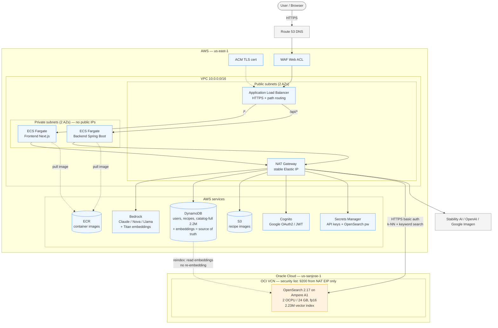

# Architecture

Current deployment architecture for the Recipe AI Finder, including the self-hosted OpenSearch node
on Oracle Cloud and the NAT-gateway / private-subnet networking. This diagram is **Mermaid**, which
GitHub renders natively — edit the text below and the picture updates, no image regeneration needed.

## System diagram

## How to read it

- **Only the ALB is internet-facing.** User traffic enters via Route 53 → WAF → ALB (in the public
  subnets). The ALB path-routes: `/*` to the frontend, `/api/*` to the backend.
- **ECS tasks run in private subnets with no public IPs.** All of their outbound traffic — AWS
  services (Bedrock, DynamoDB, S3, Cognito, Secrets Manager), image-generation APIs, and the
  self-hosted OpenSearch node — egresses through the **NAT gateway's single stable Elastic IP**.
- **The OpenSearch node lives on Oracle Cloud**, reached over HTTPS basic auth. Its firewall
  (OCI security list) only allows port 9200 from the NAT gateway's Elastic IP (plus the operator's
  admin IP), so the search port is never open to the public internet.
- **DynamoDB is the source of truth.** The OpenSearch vector index is derived from it and rebuilt by
  reading the persisted embeddings — no re-embedding — which is what made the AWS→Oracle migration
  cheap and reversible.

## Why this shape (cost + security)

- **Cost:** catalog search moved off Amazon OpenSearch Serverless (a large, always-resident vector
  index that held ~6 OCUs / ~36 GB RAM warm 24/7, an estimated several hundred to ~$1,000+/month) to
  a single fixed-price Oracle Ampere A1 VM (~$0–13/month). Full reasoning:
  [MIGRATION-aws-to-oracle-opensearch.md](MIGRATION-aws-to-oracle-opensearch.md).
- **Security:** moving ECS into private subnets behind a NAT gateway means the app containers have
  no public IPs (ALB-only exposure) and reach the internet from one known Elastic IP — which is also
  what locks down access to the Oracle search port.
